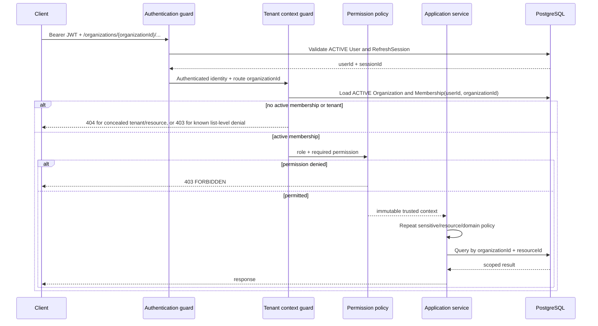

# Authentication and Authorization Design

## 1. Scope and decisions

This document defines the MVP identity, session, tenant-context, RBAC, and authorization contract. It contains no implementation code.

Key decisions:

- Email/password authentication only; OAuth, social login, MFA, and SSO are later.
- Registration creates a global User only. The user explicitly creates an Organization afterward.
- Access credentials are short-lived bearer JWTs returned in JSON. Refresh credentials are opaque values delivered only in a secure HttpOnly cookie for the browser contract.
- PostgreSQL `RefreshSession` and immutable per-rotation `RefreshToken` hash rows are authoritative.
- Access tokens contain no roles, permissions, or organization claims. Current User, session, Membership, and Organization state are checked by the backend.
- Organization route IDs select context but grant nothing. Tenant authorization comes from an ACTIVE Membership.
- Roles map to code-defined permissions. Sensitive application services repeat contextual authorization after early guards.

## 2. Identity and registration

User is a global identity with globally unique normalized email. Membership is the only source of organization role/authority. Registration accepts `email`, `password`, `firstName`, and `lastName`, creates no Organization or Membership, and does not log the user in implicitly unless the endpoint successfully creates a RefreshSession as part of the same documented response. **MVP decision:** successful registration creates the User only and returns `201`; the client then calls login. This keeps account creation and session creation independently auditable.

Email is trimmed and lowercased for identity comparison. Duplicate registration returns a generic conflict that may state the email is unavailable; login and recovery flows must not reveal whether an account exists. Email verification is recommended before public launch but is not required for the portfolio MVP. Password reset is later and must use single-use, hashed, expiring tokens when added.

## 3. Password security

- Hash passwords with Argon2id using parameters benchmarked for the production runtime and reviewed periodically. Each hash embeds its salt/parameters; rehash after successful login when parameters become outdated.
- Accept 12–128 Unicode characters. Permit spaces/passphrases. Reject common/known-compromised passwords when a local or privacy-safe service is available; do not require arbitrary character-class composition.
- Enforce maximum byte length before hashing to prevent resource abuse while documenting the character limit. Normalize input consistently only if the product explicitly chooses a Unicode normalization policy; never silently trim a password.
- Compare hashes using the library's timing-safe verifier. Perform a dummy hash verification for unknown emails to reduce timing-based enumeration.
- Never log password, hash, request body, raw token, cookie, or Authorization header.
- Login rate limits use both IP/network and normalized-email keyed buckets without creating an easy permanent account-lockout denial of service. Suggested starting policy: 5 attempts/minute per IP+email and 20/hour per account key, followed by bounded cool-down; tune from telemetry.
- Registration and future reset endpoints receive similarly strict limits and generic responses.

## 4. Access token contract

Access token is a signed JWT used as `Authorization: Bearer <token>`.

| Claim | Meaning | Rule |
|---|---|---|
| `sub` | User UUID | Required; subject must resolve to ACTIVE User |
| `sid` | RefreshSession UUID | Required; session must remain ACTIVE |
| `jti` | Unique access-token ID | Required for correlation/revocation investigation; not tenant authority |
| `iss` | Issuer | Exact configured value |
| `aud` | API audience | Must contain expected API audience |
| `iat` | Issued time | Required; reasonable clock-skew validation |
| `exp` | Expiration | Required; recommended 15 minutes after issue |

No email, role, permissions, Membership, or organization IDs are claims. Token validation checks algorithm allowlist, signature, issuer, audience, `exp`, `iat`, required claims, ACTIVE User, and ACTIVE/non-expired RefreshSession. Logout therefore takes effect immediately rather than waiting for JWT expiry. PostgreSQL is authoritative; a short safe cache may optimize session checks if invalidated on revocation.

Use asymmetric signing (recommended Ed25519 or an approved RSA/ECDSA choice supported by the selected JWT library) so verification keys can be separated from the signing key. Keys come from secret management, carry key IDs, and support overlap during rotation. Never accept `none`, algorithm switching, or client-selected keys. Recommended access lifetime is 15 minutes; do not make it long to compensate for refresh failures.

Expired, malformed, wrongly signed, wrong-audience, revoked-session, or disabled-user tokens return `401 UNAUTHENTICATED` with no JWT-library internals.

## 5. Refresh session and rotation

### Lifetimes and delivery

- A successful login creates one ACTIVE RefreshSession family with a recommended absolute lifetime of 30 days and its first ACTIVE RefreshToken row.
- The raw refresh token is at least 256 bits of cryptographically random entropy. Only a keyed/cryptographic hash suitable for token lookup is stored; the raw value exists only at issuance and in the client cookie.
- The browser receives it in a `Secure`, `HttpOnly`, `SameSite=Lax` cookie scoped narrowly to `/api/v1/auth` with an explicit maximum age. Production requires HTTPS.
- The access token is returned in JSON and should be held in memory by a future browser client, not local storage.

### Rotation

1. Refresh reads only the refresh cookie, hashes the token, and finds its RefreshToken/Session.
2. In one transaction it verifies token ACTIVE/unexpired and Session/User ACTIVE/unexpired.
3. It marks the token USED, inserts a new ACTIVE hashed RefreshToken, updates session `lastUsedAt`, and commits.
4. The response sets the new refresh cookie and returns a new access token.
5. The previous raw token becomes unusable immediately.

If a USED token is presented, treat it as possible theft: atomically mark the family COMPROMISED, revoke its active token(s), clear the cookie, audit `AUTH_REFRESH_REUSE_DETECTED`, and return `401 SESSION_COMPROMISED`. Do not issue a replacement. An invalid/expired/revoked token returns generic `401 INVALID_SESSION` and clears any presented cookie. Concurrency tests must prove two refreshes using the same token cannot both rotate successfully.

### Revocation

- `POST /auth/logout` accepts either the current access token or a valid current refresh cookie, resolves that credential's session, revokes the family and active refresh tokens, clears the cookie, and is idempotent from the user's perspective. This permits logout after access-token expiry; cookie-authenticated logout applies the Origin/CSRF policy.
- `POST /auth/logout-all` requires current authentication and revokes every ACTIVE session for the User, including current. It clears the current cookie and returns `204`.
- Password change, account disablement, detected refresh reuse, and security support actions revoke all applicable sessions.
- Session management UI endpoints may be added later. MVP does not expose IP/user-agent beyond safe device labels.

## 6. Browser, CORS, and CSRF contract

- Production CORS uses an explicit configured origin allowlist; never `*` with credentials.
- Access-authenticated API mutations use the Bearer header and are not ambient-cookie authenticated.
- Refresh/logout endpoints use an HttpOnly cookie. `SameSite=Lax`, strict Origin/Referer validation for configured browser origins, narrow cookie Path, and JSON-only POST reduce CSRF risk. If deployment requires cross-site `SameSite=None`, add a server-issued double-submit CSRF token and require it on refresh/logout before enabling that topology.
- Set `Access-Control-Allow-Credentials: true` only for approved origins needing refresh cookies. Preflight permits only documented methods/headers, including `Authorization`, `Idempotency-Key`, `If-Match`, and `X-Request-Id`.
- Cookies are never used to carry access JWTs in MVP.

## 7. Authentication endpoint behavior

| Method/route | Authentication | Credential behavior | Result |
|---|---|---|---|
| `POST /api/v1/auth/register` | None | No token/cookie | `201` safe User |
| `POST /api/v1/auth/login` | None | Creates family; sets refresh cookie; returns access JWT | `200` token metadata + User |
| `POST /api/v1/auth/refresh` | Refresh cookie | Rotates cookie; returns access JWT | `200` or generic `401` |
| `POST /api/v1/auth/logout` | Bearer or valid refresh cookie | Revokes current session; clears cookie | `204` |
| `POST /api/v1/auth/logout-all` | Bearer | Revokes all User sessions; clears cookie | `204` |
| `GET /api/v1/me` | Bearer | No credential change | `200` safe User |
| `GET /api/v1/organizations` | Bearer | Lists ACTIVE memberships; canonical organization selector | `200` tenant summaries |

Login returns the same `401 INVALID_CREDENTIALS` for unknown email, wrong password, or an account that must not disclose status. A disabled user never receives new credentials. Successful login updates `lastLoginAt` without making it an authorization source.

## 8. Tenant-context resolution

Conceptual trusted context contains `requestId`, `userId`, `sessionId`, `organizationId`, `membershipId`, role, derived permission set, organization currency/timezone/status, and authentication time if available. It is created server-side and immutable. Services receive this context rather than a body-supplied organization ID.

Route `organizationId` is acceptable because it makes URLs explicit, supports multi-organization users, and avoids hidden “current tenant” state. It only identifies the tenant to authorize. A body/query `organizationId` on a scoped command is an unknown forbidden property and yields validation error; it never overrides context.

## 9. IDOR and tenant defenses

1. Authenticate and establish ACTIVE Membership before tenant operations.
2. Query owned resources by both trusted `organizationId` and resource ID. Never request-path `findById(id)` followed by an optional tenant check.
3. Create relationships only through same-tenant scoped lookups; composite database FKs are the final backstop.
4. Return `404 RESOURCE_NOT_FOUND` for a resource UUID that is missing or belongs to another tenant. Do not reveal which.
5. Return `403 FORBIDDEN` when Membership is known/active but its role lacks the endpoint permission.
6. Reports, export metadata/downloads, notifications, audit records, and jobs use identical scope rules.
7. Repository/application APIs without tenant parameters are prohibited for request/job access to tenant tables.

## 10. Roles

| Role | Stable purpose |
|---|---|
| OWNER | Sole tenant owner; all ordinary capabilities plus ownership transfer and closure |
| ADMIN | Operational administration and finance, but cannot become/modify Owner or close tenant |
| ACCOUNTANT | Finance operator: customers, invoices, payments, expenses, analytics/reports/audit; no organization/member administration |
| MEMBER | Operational customer and invoice author/issuer; no payments, expenses, analytics, exports, audit, or administration |
| VIEWER | Read-only customers/invoices/expenses plus analytics and reports/export; no mutations/audit/member administration |

## 11. Canonical permissions

| Namespace | Permissions |
|---|---|
| Organization | `organization.read`, `organization.update`, `organization.close`, `organization.transfer_ownership` |
| Membership | `membership.read`, `membership.invite`, `membership.change_role`, `membership.suspend`, `membership.remove` |
| Customer | `customer.read`, `customer.create`, `customer.update`, `customer.archive` |
| Invoice | `invoice.read`, `invoice.create`, `invoice.update_draft`, `invoice.delete_draft`, `invoice.issue`, `invoice.cancel`, `invoice.void` |
| Payment | `payment.read`, `payment.create`, `payment.reverse` |
| Expense | `expense.read`, `expense.create`, `expense.update`, `expense.void`, `expense_category.manage` |
| Analytics/report | `analytics.read`, `report.read`, `report.export` |
| Notification | `notification.read`, `notification.update_self` |
| Audit | `audit.read` |

Permissions are constants mapped from role in code. Database stores only Membership role. Future custom roles will require a reviewed migration; no arbitrary client permission strings are accepted.

## 12. Role-permission matrix

Legend: ✓ granted; — denied. A grant still requires contextual/domain policy.

| Permission | Owner | Admin | Accountant | Member | Viewer |
|---|:---:|:---:|:---:|:---:|:---:|
| `organization.read` | ✓ | ✓ | ✓ | ✓ | ✓ |
| `organization.update` | ✓ | ✓ | — | — | — |
| `organization.close` | ✓ | — | — | — | — |
| `organization.transfer_ownership` | ✓ | — | — | — | — |
| `membership.read` | ✓ | ✓ | — | — | — |
| `membership.invite/change_role/suspend/remove` | ✓ | ✓ | — | — | — |
| `customer.read` | ✓ | ✓ | ✓ | ✓ | ✓ |
| `customer.create/update/archive` | ✓ | ✓ | ✓ | ✓ | — |
| `invoice.read` | ✓ | ✓ | ✓ | ✓ | ✓ |
| `invoice.create/update_draft/delete_draft/issue` | ✓ | ✓ | ✓ | ✓ | — |
| `invoice.cancel/void` | ✓ | ✓ | ✓ | — | — |
| `payment.read/create/reverse` | ✓ | ✓ | ✓ | — | — |
| `expense.read` | ✓ | ✓ | ✓ | — | ✓ |
| `expense.create/update/void` | ✓ | ✓ | ✓ | — | — |
| `expense_category.manage` | ✓ | ✓ | ✓ | — | — |
| `analytics.read` | ✓ | ✓ | ✓ | — | ✓ |
| `report.read/export` | ✓ | ✓ | ✓ | — | ✓ |
| `notification.read/update_self` | ✓ | ✓ | ✓ | ✓ | ✓ |
| `audit.read` | ✓ | ✓ | ✓ | — | — |

ADMIN membership grants do not permit targeting OWNER, assigning OWNER, or escalating self beyond ADMIN. OWNER role changes occur only through ownership transfer. Notification permissions are limited to the authenticated user's own rows.

## 13. Authorization responsibilities

### Guard/controller boundary

- Validate bearer credentials and current User/Session.
- Resolve tenant Membership and Organization.
- Check endpoint's coarse canonical permission.
- Attach trusted context; reject early with stable 401/403/404.
- Validate only allowlisted transport fields.

### Application/domain boundary

- Repeat permission/policy for sensitive commands so non-HTTP callers cannot bypass it.
- Scope resource/relationship loading to context tenant.
- Enforce target-specific rules: Admin cannot touch Owner; Owner transfer target ACTIVE; last-owner preserved; issued invoice immutable; cancel/void/payment/reversal states valid; customer/category same tenant; export belongs to tenant.
- Execute required transaction, idempotency, locking, audit, and post-commit event.

Decorators or guards alone are insufficient for ownership transfer, member role change/removal, invoice issue/cancel/void, payment creation/reversal, expense void, organization currency/update/close, and report export/download.

## 14. Sensitive operations

The following require current DB-backed authorization, same-transaction audit, strict rate limits where applicable, and should gain recent-password/MFA confirmation when that capability exists: ownership transfer, organization closure, role change/removal/suspension, payment reversal, currency/high-risk organization settings, logout-all, and bulk financial exports. MVP does not invent MFA, but ownership transfer should require a recently authenticated session (recommended login/refresh activity within 15 minutes) or return `REAUTHENTICATION_REQUIRED`.

## 15. Audit identity

Clients cannot set actor User, Membership, Session, IP, or request ID in an audit payload. The backend derives them from validated identity/context and transport metadata. Background jobs use `WORKER` actor plus originating request/event correlation. Impersonation is not an MVP feature.

## 16. Request and correlation IDs

Every request has a server-trusted ID. A client may send `X-Request-Id` only if it matches a conservative printable UUID/ULID-style format and length; otherwise the server generates a UUID. Even a valid incoming value is tagged as external and must not be assumed unique, so internal correlation may additionally be generated. The response echoes the effective `X-Request-Id`; logs, errors, audit, and pending events carry it. Never allow CR/LF or arbitrary unbounded values.

## 17. Rate-limit policy

- Strong: register, login, refresh, invitation accept, future password reset/verification.
- Elevated: organization create/close/transfer, member invite/change, payment/reversal, report export.
- Broad authenticated tenant quota: ordinary reads/writes, keyed by User + Organization with IP fallback.
- Return `429 RATE_LIMITED` and `Retry-After`; do not disclose account existence. Financial operations rely on idempotency as well as limiting.
- Limits are configuration, observable, and tuned; trusted workers use separately authenticated queue paths, not public bypass headers.

## 18. Authentication and authorization test plan

### Authentication

- Registration succeeds; duplicate normalized/case-variant email conflicts; invalid/oversized password fails.
- Login succeeds and returns minimal JWT/refresh cookie; wrong email/password and disabled User return generic failure.
- JWT expiry, wrong signature/issuer/audience/algorithm, missing claims, revoked/expired session, and disabled User return 401.
- Refresh rotates exactly once; old token is rejected; reuse marks family compromised; parallel refresh yields one success.
- Logout revokes current session and is harmless when repeated with already-revoked context policy; logout-all revokes all sessions.
- Raw passwords/tokens/cookies never appear in DB/log/audit snapshots.

### Authorization

- Unauthenticated request 401; non-member/inactive member denied; insufficient permission 403.
- Every role/permission matrix cell is exercised. Admin cannot close/transfer tenant or target Owner; Accountant cannot manage members; Member cannot pay; Viewer cannot mutate.
- Role/status changes take effect on the next request without access-token reissue because claims contain no authority.
- Last Owner cannot be removed/downgraded; atomic transfer produces exactly one Owner.
- Service invocation without controller still enforces sensitive policy.

### Tenant isolation/IDOR

- Tenant A cannot read/update/archive B Customer, retrieve B Invoice by known UUID, pay B Invoice, use B Customer/Category, view B analytics/audit/notification, or download B export.
- Changing route organization to B without membership fails. Adding body `organizationId` is rejected and never changes context.
- Cross-tenant/nonexistent owned IDs are indistinguishable 404; known active tenant with insufficient permission is 403.
- Job payload tenant mismatch is suppressed/failed safely after scoped reload.

# Prompt 3 Authorization Review Checklist

- [ ] Authentication flow is defined
- [ ] Access token lifetime strategy is defined
- [ ] Refresh session/token model matches Prompt 2
- [ ] Refresh rotation/reuse detection is defined
- [ ] Password security expectations are defined
- [ ] Organization context resolution is defined
- [ ] Membership validation is defined
- [ ] RBAC permissions are code-defined or otherwise explicitly finalized
- [ ] Role escalation protections are defined
- [ ] Service-level authorization responsibilities are defined
- [ ] Last-owner protection is defined
- [ ] Sensitive operations are identified
- [ ] IDOR protections are explicit
- [ ] Cross-tenant lookups are scoped
- [ ] Audit actor identity comes from auth context
- [ ] Auth testing scenarios are documented
- [ ] Authorization tests are documented
- [ ] Tenant-isolation tests are documented
- [ ] No guards/decorators/code have been generated
