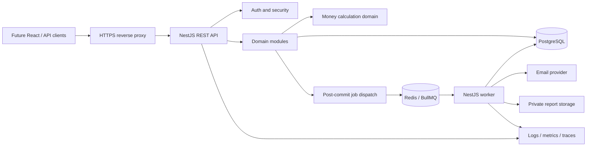
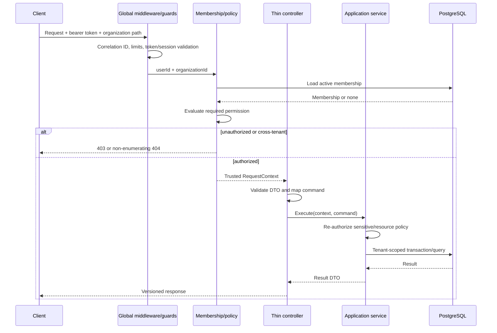
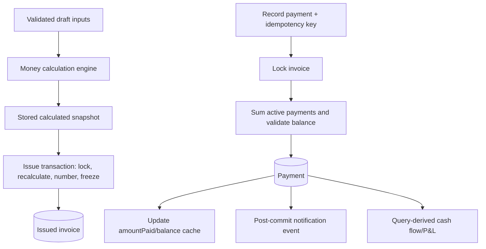

# Backend Architecture

## 1. Architecture overview

The backend is a NestJS modular monolith deployed as one API process plus one or more worker processes from the same codebase. PostgreSQL is the system of record. Redis supports BullMQ, rate-limiting counters, and short-lived coordination; financial correctness never depends on Redis. Prisma is used behind module-owned repositories/application services. HTTP controllers are adapters, not business-rule containers.



### Why a modular monolith

Invoice issue, payment, balance, membership, and audit operations need local ACID transactions and share a closely related domain. One deployable is simpler to develop and operate while module boundaries keep future extraction possible. Microservices would introduce distributed authorization, event delivery, and consistency problems without an MVP benefit.

## 2. Major architecture decisions

| Decision | Rationale | Alternatives considered | Consequences |
|---|---|---|---|
| NestJS modular monolith | Cohesive codebase and ACID boundary | Microservices; unstructured monolith | Enforce dependency rules in code/reviews |
| Shared PostgreSQL with scoped rows | Simplest robust tenancy for SMEs | Schema/database per tenant | `organizationId` is mandatory throughout tenant data access |
| Application isolation; no initial RLS | Lower Prisma/operations complexity for MVP | PostgreSQL RLS | Central repositories, scoped APIs, negative tests, and review gates are mandatory; RLS is a later defense-in-depth option |
| Code-defined permissions | Static SME roles are easy to audit | DB permission engine | Custom roles need a future migration |
| Decimal money domain | Prevents floating-point errors | JS numbers; minor-unit-only integers | Decimal values cross APIs as strings |
| Organization route context | Explicit, bookmarkable resource hierarchy | Header/current-tenant state | Membership must still be loaded for every request |
| Sync ACID financial writes | Immediate invariant preservation | Queue/eventual writes | Transactions must stay short; external side effects are post-commit jobs |
| Internal events after commit | Decouples notifications/audit-adjacent side effects | Direct cross-module calls | Consumers must be idempotent; events are not the financial source of truth |
| Cash-basis reporting | Matches payments and paid-expense data | Accrual/full ledger | Reports are management statements, not accounting compliance artifacts |

## 3. Module boundaries and dependency direction

### Business modules

| Module | Owns | Public application operations | May depend on | Must not own |
|---|---|---|---|---|
| Authentication | credentials, sessions/refresh tokens, token issuance | register, login, refresh, logout, revoke sessions | Users, Security, Audit | organization roles |
| Users | global profile/account status | get/update self, disable account (admin/support flow) | Audit | tenant authority |
| Organizations | organization profile/settings/lifecycle, invoice sequence policy | create, view/update, suspend/close, transfer ownership orchestration | Memberships interface, Audit | customer/finance records |
| Memberships | memberships and invitations | invite/add, accept, suspend/remove, change role, query membership | Users, Organizations identity, Authorization, Audit | global credentials |
| Authorization | code role-permission map and policies | authorize actor/action/resource | Memberships read interface | persistence/business mutation |
| Customers | customer master data | create/read/update/archive | Authorization, Audit | invoices |
| Invoices | invoice aggregate, items, numbering, finalization | draft CRUD, calculate, issue, cancel/void, query | Customers read contract, Money, Authorization, Audit interface | payment persistence |
| Payments | payment/reversal records and invoice settlement coordination | record, reverse, query | Invoices settlement contract, Money, Idempotency, Authorization, Audit | gateway processing |
| Expenses | expenses and categories | CRUD/void, category management | Money, Authorization, Audit | accounts payable |
| Financial Analytics | read models/queries for receivables and KPIs | summaries, aging, time series | read contracts from Invoices/Payments/Expenses | mutable financial facts |
| Reports | report queries and export lifecycle | preview/export/download authorization | Analytics and domain read contracts, Jobs | source financial data |
| Notifications | durable in-app notifications and reminder policy/delivery state | list/read; schedule/deliver internal operations | Invoices read contract, Jobs | invoice state |
| Audit | append-only audit entries and queries | append, tenant-scoped list | request/actor context | domain decisions |

### Supporting modules

- **Money** centralizes decimal parsing, currency metadata, rounding, invoice calculation, and serialization. This prevents inconsistent arithmetic.
- **Idempotency** atomically claims operation keys and stores request hashes/results for high-risk retried commands.
- **Jobs/Queues** defines queue names, typed/versioned payloads, producer and worker adapters, retry/dead-letter conventions.
- **Database** owns Prisma lifecycle, transaction abstraction, health, and migration conventions—not generic business repositories.
- **Security** contains password/token primitives, rate-limit policies, encryption helpers, and secure headers.
- **Observability/Health** provides correlation, structured logs, metrics, redaction, liveness/readiness.
- **Configuration** validates environment variables at boot and exposes typed configuration.

### Dependency rules

1. Controllers depend on their module's application services and DTO mappers.
2. Application services orchestrate domain objects/policies/repository ports and transactions.
3. Domain code is framework-agnostic and depends only on shared Money primitives where necessary.
4. Persistence adapters implement module-owned ports; no module imports another module's Prisma repository directly.
5. Cross-module synchronous calls use small exported application/read interfaces. Avoid bidirectional dependencies.
6. Post-commit internal events handle noncritical side effects. Financial commands never depend on asynchronous consumers.
7. Audit writes required for the same mutation occur in the same database transaction where feasible; operational delivery events may be asynchronous.

Recommended direction:

```text
HTTP adapter -> application service -> domain/policy -> repository port -> Prisma adapter
                                      -> exported module contract
                                      -> post-commit event/job
```

Cycles are resolved by moving orchestration to the owning use case. For example, Payments owns “record payment” and calls an Invoices settlement contract inside one transaction; Invoices does not call Payments back.

## 4. Request lifecycle



Global order is: request/correlation middleware → secure headers/CORS → rate limit → authentication guard → route/DTO validation → tenant membership guard → coarse permission guard → controller → service/resource policy → tenant-scoped persistence → response/error mapper → structured completion log.

The trusted request context contains `requestId`, `userId`, `sessionId`, selected `organizationId`, `membershipId`, role/permission set, organization timezone/currency, and authentication strength. It is derived server-side and immutable to downstream code.

## 5. Authentication architecture

1. Registration normalizes email and hashes password using Argon2id and creates only the global User. A later explicit organization-creation command creates the Organization, Owner Membership, sequence, and defaults in one transaction.
2. Login verifies without revealing account existence, applies IP/email-keyed throttles, inserts a `RefreshSession` family plus its first hashed `RefreshToken` record, and emits a short access JWT plus opaque refresh token.
3. Access JWT is short-lived (recommended 10–15 minutes), signed with an asymmetric key or well-managed rotating symmetric key, and contains `sub`, `sid`, `iat`, `exp`, issuer, and audience. It contains no authoritative role.
4. Protected requests verify signature/claims and enforce session/user revocation policy. High-risk operations can query current session explicitly.
5. Refresh accepts the opaque token over a secure, HTTP-only, SameSite cookie for browser use (or a protected native-client channel), hashes it, rotates it atomically, and detects reuse. CSRF protections apply if cookies authenticate state-changing endpoints.
6. Logout revokes the family. Password change/logout-all increments/revokes relevant session state.

Store only token hashes in immutable per-rotation `RefreshToken` rows, with creation/expiry/used/revoked state linked to a `RefreshSession` family, user, and safe device metadata. Redis may accelerate revocation checks but PostgreSQL is authoritative.

## 6. Tenant resolution and authorization

Tenant routes use `/api/v1/organizations/:organizationId/...`. A guard parses the UUID and asks Memberships for an active `(userId, organizationId)` membership. It then loads safe organization context. Client body tenant IDs are prohibited.

Authorization has four layers:

1. **Authentication guard:** valid user/session.
2. **Tenant guard:** active membership and active organization.
3. **Permission policy:** role maps to code-defined permissions such as `invoice.issue`.
4. **Service/resource policy:** repeats critical authorization and checks resource membership, ownership transfer rules, lifecycle, and same-tenant relationships.

Repository methods make unsafe access difficult: `findInvoice({ organizationId, invoiceId })`, never `findInvoiceById(id)` for request paths. Create data injects organization from context. Updates/deletes use composite predicates and verify affected row count. Reports and workers use the same scoped read contracts.

### RLS decision

PostgreSQL RLS is not enabled for MVP. Prisma connection pooling and transaction-local tenant variables make correct RLS integration operationally subtle; migrations and background/system jobs also need carefully separated roles. Robust application isolation comes from scoped interfaces, composite keys, service policies, central context, lint/review conventions, and adversarial tests. Reconsider RLS as defense in depth before enterprise deployment; introduce it with per-transaction `SET LOCAL` context, restricted application DB roles, worker policies, and integration tests—never as a substitute for authorization.

## 7. RBAC details

Permissions are constants grouped by domain. Roles map to immutable permission sets in source control. A policy service answers `can(actor, permission, resourceContext)`; controllers may declare a permission metadata requirement but services perform definitive sensitive checks.

Owner safeguards are contextual policies, not merely permissions: Admin cannot modify an Owner; an actor cannot escalate to Owner; transfer requires current Owner, target active member, recent authentication, and a transaction locking organization and memberships. Role/membership changes invalidate relevant cached authorization immediately; avoid long-lived permission claims in access tokens.

The canonical role matrix is in `product-requirements.md`. Tests must enumerate every role/action mapping plus contextual exceptions.

## 8. Financial calculation architecture

The Money domain exposes typed decimal value objects/functions:

- parse and validate canonical decimal strings;
- enforce currency scale and configured maximums;
- round using one documented mode (half away from zero);
- add/subtract/multiply without JS floating point;
- calculate invoice snapshot in the required sequence;
- serialize decimals as fixed/canonical strings.

Clients send quantity/unit price/discount/tax inputs, never trusted totals. Draft mutation recalculates and stores subtotal, discount, tax, total. Issue recomputes from items under lock and freezes the snapshot. Payment balance uses the stored finalized total and active payments. Analytics aggregates PostgreSQL `NUMERIC` values and converts through Decimal, never number.



## 9. Transaction strategy

Transactions are application-service boundaries and receive transaction-bound repositories. No network/email/queue wait occurs inside a database transaction.

| Mutation | Atomic records/actions | Concurrency strategy |
|---|---|---|
| Register User | User and global security audit | Unique normalized email; rollback all |
| Create organization | Organization, Owner membership, sequence, defaults, audit | Unique slug/Owner constraints; rollback all |
| Update ownership | Organization owner reference if used, old/new memberships, audit | Lock organization and relevant memberships; validate exactly one Owner |
| Invoice draft create/update | Invoice, replace/diff items, calculated totals, audit | Lock invoice on update; optimistic `version` also prevents lost edits |
| Issue invoice | Lock draft, validate/recalculate, lock sequence, increment, assign number/status, audit | Deterministic lock order; unique tenant number fallback |
| Cancel/void | Lock invoice, confirm no active payments, change status, audit | Payment creation locks same invoice first |
| Record payment | Claim idempotency, lock invoice, sum payments, insert payment, update cache/version, audit | Invoice row serialization prevents overpayment |
| Reverse payment | Lock invoice then payment, validate active, mark reversed/create reversal metadata, update cache, audit/idempotency | Same lock order as creation |
| Expense mutation | Expense/category validation plus audit | Optimistic version for update; unique idempotency if imported/retried |
| Membership/role change | Membership(s), invitation where relevant, audit | Lock organization/memberships; protect Owner/last privileged actor |

Failures roll back facts, cached totals, idempotency claim/result, and required audit together. Post-commit dispatch failure is handled by a reliable dispatch table/outbox-lite if delivery is required; otherwise a retryable dispatcher polls pending events. Never enqueue before commit.

## 10. Redis, BullMQ, and background jobs

Queues:

| Queue/job | Trigger | Minimal payload | Retry/idempotency |
|---|---|---|---|
| `reminders.scan` | Repeatable scheduler, bounded by date/tenant shard | job version, effective UTC time/cursor | Singleton schedule; scan is repeatable |
| `reminders.deliver` | Eligible invoice found | version, organizationId, invoiceId, reminder type/effective date | Unique semantic delivery key; bounded exponential retries |
| `notifications.email` | Post-commit notification | organizationId, notificationId, template version | Provider key + delivery state; retry transient only |
| `reports.generate` | Large export requested | organizationId, exportId | Export state machine and unique export ID |
| `sessions.cleanup` | Daily schedule | cutoff/version | Idempotent batched deletion/expiry marking |
| `events.dispatch` | Poll pending post-commit events | event ID | Claim/lease and processed consumer key |

Workers validate payload schema/version, load the tenant/resource using scoped repositories, recheck current eligibility, and record attempts. They do not trust payload roles or totals. Backoff is exponential with jitter; non-retryable validation/not-found becomes completed/suppressed; exhausted transient failures are retained as failed jobs and alerted. Dashboard access is administrative and secured.

```mermaid
sequenceDiagram
  participant S as Scheduler/API
  participant Q as BullMQ/Redis
  participant W as Worker
  participant DB as PostgreSQL
  participant E as Email/Storage
  S->>Q: Enqueue typed job with organizationId
  Q->>W: At-least-once delivery
  W->>W: Validate payload/version
  W->>DB: Tenant-scoped load + eligibility/idempotency check
  alt stale/ineligible/already complete
    W-->>Q: Complete as suppressed/idempotent
  else eligible
    W->>E: Idempotent external operation
    W->>DB: Store outcome/attempt/audit metadata
    W-->>Q: Complete
  end
  Note over Q,W: Transient error: bounded exponential retry; exhausted: failed/dead-letter alert
```

## 11. Audit architecture

Domain application services create structured audit facts at the point a mutation succeeds. Financial/permission audit entries share the domain transaction. Entry fields are actor type/user/session, organization, action, entity type/ID, outcome, allowlisted changes, request/correlation ID, occurred time, and safe network metadata.

Audit persistence is append-only through a narrow `append` interface. There is no normal update/delete operation. Database grants should deny application-level update/delete when feasible. Read access is tenant-scoped and permission-protected. Large or secret-bearing values are excluded/redacted; before/after objects use field allowlists.

## 12. Error handling and API conventions

### REST conventions

- Base path `/api/v1`; plural kebab-case resources.
- Tenant resources nested beneath `/organizations/:organizationId`.
- Opaque UUIDs are API identifiers; invoice number is display/search data.
- Cursor pagination is preferred for mutable lists: `limit` (default 25, max 100), `after`, with deterministic `(createdAt,id)` or domain sort.
- Filters are allowlisted; sorting uses `sort=field:asc|desc`; date filters use `fromDate`/`toDate` ISO dates with documented inclusive semantics.
- Responses serialize money as decimal strings and timestamps as ISO 8601 UTC; business dates as `YYYY-MM-DD`.
- `Idempotency-Key` is required for payment creation and supported for other retry-sensitive commands.

### Status and error shape

- `200` read/update/action result, `201` create, `204` successful no-body delete/logout.
- `400` malformed request, `401` no/invalid authentication, `403` known-tenant insufficient permission, `404` missing or cross-tenant resource, `409` lifecycle/version/idempotency conflict, `422` semantically invalid business input, `429` rate limit.
- Errors use `{ "error": { "code": "PAYMENT_EXCEEDS_BALANCE", "message": "...", "details": [...], "requestId": "..." } }`.
- Validation details contain field, stable code, and safe message. Stack traces, SQL, internal IDs, and tenant existence are never exposed.

Optimistic mutation requests should support an explicit `version` or `If-Match` value for draft/customer/expense edits, returning `409` on lost updates.

## 13. Security architecture

- Argon2id password hashing; constant-time token/hash comparisons; short JWT lifetime; refresh rotation/reuse detection; key rotation plan.
- Per-IP and per-account-key login limits; global and sensitive-route rate limits; escalating cool-down without enabling account-lockout denial of service.
- Helmet-style secure headers, TLS-only production, strict known-origin CORS, safe cookie attributes, CSRF defense for cookie-authenticated state changes.
- DTO allowlists, maximum lengths/counts/ranges, safe file/export names, Prisma parameterization, no raw SQL without reviewed parameter binding.
- Least-privilege database/Redis/service credentials from a secret manager; never images/source control; separate production credentials and backups.
- PII/log redaction; structured error codes; correlation IDs not derived from untrusted strings without validation.
- Report downloads require current tenant membership and permission even with opaque IDs; use short-lived signed object URLs only after authorization.
- No card PAN/CVV. If direct processing is added, use a PCI-compliant provider/tokenization and conduct separate PCI-DSS scoping.
- Dependency/scanner checks, locked packages, migration review, backups and restore exercises before production.

## 14. Logging and observability

JSON logs include timestamp, level, service/process, request/job ID, safe route template, status, duration, user/organization IDs where authenticated, event/error code, and stack only in protected server logs. Do not log authorization headers, cookies, request bodies by default, customer tax IDs, raw email templates, or financial report contents.

Metrics include request/error/latency by route, DB pool/latency, transaction conflicts, auth failures/rate limits, queue depth/age/retry/failure, reminder delivery, report duration/size, and reconciliation mismatches. Alerts cover elevated 5xx, database/Redis health, queue backlog, failed financial invariants, and exhausted delivery jobs.

## 15. Testing architecture

### Unit tests (fast, no infrastructure)

- Decimal parsing, currency scale, rounding, invoice calculation table cases.
- Payment/balance/status and overdue derivation across timezones.
- Role-permission matrix and contextual Owner policies.
- Date-range conversion, report formulas, idempotency request hashing.
- Domain lifecycle transitions and job eligibility/idempotency functions.

### Integration tests (real PostgreSQL; Redis where relevant)

- Prisma mappings, numeric precision, foreign/composite unique/check constraints.
- All transaction rollback and lock/concurrency cases.
- Tenant-scoped repository behavior and same-tenant composite relationships.
- Sequence generation under parallel issue attempts.
- Parallel payments never exceed invoice total; cached balance reconciles.
- Session rotation/reuse and idempotency claim behavior.
- BullMQ retry, duplicate delivery, stale job, and failed-job behavior.

### API/E2E tests (NestJS + Supertest)

- Auth/session lifecycle, validation/error shape, rate-limit policies.
- Every invoice/payment/expense lifecycle and permission boundary.
- Organization A cannot read/update/delete Organization B resources.
- Valid foreign UUID guesses and altered path/body `organizationId` fail.
- Cross-tenant related IDs, reports, notifications, audit entries, and exports fail.
- Report totals/date ranges reconcile with created fixtures.

Test databases are isolated and migrated like production. Tests use deterministic clocks/timezones, decimal string assertions, factories with explicit tenant, and parallel-safe cleanup. Critical concurrency tests use separate DB connections rather than mocked repositories.

## 16. Proposed folder structure

```text
backend/
  src/
    main.ts
    app.module.ts
    config/
      configuration.ts
      environment.schema.ts
    common/
      context/              # request/actor/tenant context types and provider
      errors/               # domain-to-HTTP error mapping
      http/                 # pagination, response serializers, pipes
      observability/        # logging, correlation, metrics
      security/             # generic security primitives; no domain roles
      time/                 # clock and organization-date helpers
    database/
      prisma/               # client lifecycle and transaction support
      migrations/           # created later by Prisma
      health/
    queues/
      contracts/            # versioned job payloads
      producers/
      workers/
      queue.module.ts
    modules/
      authentication/
      users/
      organizations/
      memberships/
      authorization/
      customers/
      invoices/
      payments/
      expenses/
      money/
      analytics/
      reports/
      notifications/
      audit/
      idempotency/
      health/
      <module>/
        api/                 # controllers, request/response DTOs
        application/         # use cases/orchestration and ports
        domain/              # entities, value objects, policies, events
        infrastructure/      # Prisma/external adapters
        tests/               # colocated unit tests where useful
  test/
    integration/
    e2e/
    fixtures/
```

Not every simple module needs every layer/file. A small module can combine application services sensibly; abstractions are introduced only at real framework, persistence, external-provider, or cross-module boundaries. Controllers parse/validate/contextualize and call one use case. DTOs never become domain entities. Prisma records do not leak as API responses.

## 17. Evolution boundaries

Potential future extraction candidates are notifications/email and report generation because they are asynchronous and have clear contracts. Financial facts should remain together until scale and team ownership justify decomposition. RLS, read replicas, materialized analytics, object storage, and custom roles are evidence-driven enhancements, not MVP prerequisites.
