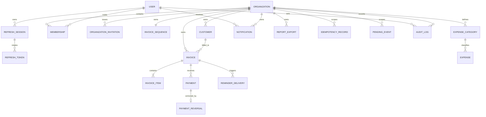

# Database Design

## Prompt 15 implemented persistence

No schema or migration change is needed for Payments. Existing Payment,
PaymentReversal, Invoice, IdempotencyRecord, AuditLog and PendingEvent rows are
used with their tenant composite foreign keys, unique indexes and financial
CHECK constraints intact. Payment reference/notes are not present in the current
Prisma schema and are deferred, including reference search.

Application transactions serialize on the tenant Invoice row; reversal then
locks Payment. RECORDED payment sums are PostgreSQL Decimal values and maintain
Invoice amountPaid/balanceDue/version. Full reversal preserves Payment facts and
creates exactly one PaymentReversal with the original Decimal amount. A cached
sum mismatch rejects the mutation rather than silently repairing data.

The IdempotencyRecord unique organization/User/operation/key index arbitrates
concurrent claims. Under READ COMMITTED, an identical loser waits and reads the
committed winner's result. Financial mutation, audit receipt, PendingEvent and
claim completion share the same transaction client. Immutable audit afterData
holds a minimal financial receipt (Payment identity/status/timestamps and Invoice
financial summary); immutable Payment/Reversal rows supply the remaining fields
for original-response replay. No response blob or customer/document PII is stored
on the idempotency claim. expiresAt is set at least 30 days ahead; retained expired
keys still replay, and no cleanup process is introduced.

## 1. Status, authority, and refinements

This is the implementation-ready logical PostgreSQL blueprint. It refines the other planning documents but intentionally contains no Prisma schema or migration SQL. PostgreSQL is authoritative; Redis/BullMQ never owns financial truth.

Three Prompt 1 ambiguities are resolved:

| Topic | Existing direction | Refinement and impact |
|---|---|---|
| Refresh rotation | Hashed rotating refresh sessions with reuse detection | Use a `RefreshSession` family plus immutable `RefreshToken` hash rows. Overwriting one hash cannot detect reuse of older tokens. |
| Cancel versus void | Both retained states; no active payments | `CANCELLED` means an issued invoice with no Payment rows ever. `VOID` means an invalid issued invoice, possibly with fully reversed payment history. |
| Expense reporting lock | Editing before a possible reporting lock | MVP has no period lock. ACTIVE expenses are versioned/audited edits; VOIDED expenses are immutable. Reports do not silently lock data. |

Payment reversal remains a full correction, not a refund. Invitations are included in the initial logical schema even if email delivery is enabled later. All other Prompt 1 decisions remain: modular monolith, shared database, no initial RLS, code-defined RBAC, one base currency per organization, invoice-level tax/discount, one invoice per payment, and cash-basis reporting.

## 2. Design principles and types

1. `Organization` is the tenant root. Every tenant-owned row, including children, stores non-null `organizationId`.
2. Request-path queries use `(organizationId,id)`. Client input never supplies trusted ownership.
3. Same-tenant relations use composite foreign keys where practical.
4. UUIDs are opaque keys; invoice numbers are tenant-local business identifiers.
5. Financial values use exact decimals. No authoritative value passes through JavaScript `number`.
6. Business dates use `DATE`; instants use `TIMESTAMPTZ(3)` in UTC.
7. Lifecycle states replace a generic `deletedAt` model.
8. Database constraints protect row/relationship invariants; services protect cross-row rules in transactions.
9. Mutable roots use integer `version`; issue/payment/cancellation additionally use row locks.
10. Financial/authorization mutations append AuditLog in the same transaction.

| Concept | PostgreSQL | Prisma recommendation | Rule |
|---|---|---|---|
| ID | `UUID` | UUID-native `String` | Generated once, immutable |
| Instant | `TIMESTAMPTZ(3)` | timestamptz `DateTime` | UTC |
| Business date | `DATE` | date-native `DateTime` | API `YYYY-MM-DD` |
| Currency | `CHAR(3)` | `String` | Uppercase ISO 4217 |
| Money/result | `NUMERIC(19,4)` | `Decimal` | Currency-scale validated |
| Quantity | `NUMERIC(19,6)` | `Decimal` | Positive, max 6 fractional digits |
| Percentage | `NUMERIC(9,6)` | `Decimal` | Percent units 0–100 |
| Version | `INTEGER` | `Int` | Starts 1, increments per mutation |
| Safe metadata | `JSONB` | `Json` | Schema/size/keys validated |

## 3. Tenancy and entity relationships

Global tables are `User`, `RefreshSession`, and `RefreshToken`. All remaining tables are tenant-owned except that `AuditLog.organizationId` may be null for a truly global authentication event.

Every tenant parent exposes unique `(organizationId,id)`. A child relation carries both columns: Invoice → Customer, InvoiceItem → Invoice, Payment → Invoice, PaymentReversal → Payment, Expense → ExpenseCategory, and ReminderDelivery → Invoice. Organization deletion is `RESTRICT` in ordinary operation.

PostgreSQL RLS remains deferred. Defense in depth consists of trusted request context, scoped repository signatures, composite FKs/indexes, runtime least privilege, and adversarial tests. RLS can be added later with transaction-local tenant context; it is not an authorization substitute.

### Why child tables repeat `organizationId`

Parent-only tenancy saves one UUID but enables unsafe ID-only child access, requires joins for every scope check, and cannot directly prevent cross-tenant references. Repeating the key enables tenant-first indexes, composite FKs, safer jobs/reports, and future partitioning. The duplication is acceptable because the database constrains it; clients never set it.

## 4. Field-level entity catalog

Unless stated otherwise, strings are trimmed and length-bounded, UUID/time fields are server-set, and `createdAt`/`updatedAt` are required `TIMESTAMPTZ(3)` defaulting to now.

### 4.1 User

Global identity only; role, organization title/permissions, currency, and billing settings must never be stored here.

| Field | Purpose | PostgreSQL / Prisma | Required/default | Validation, key, mutability |
|---|---|---|---|---|
| `id` | Identity | UUID / String | Required/generated | PK; immutable |
| `email` | Display/login email | varchar(320) / String | Required | Valid; security-controlled change |
| `normalizedEmail` | Identity key | varchar(320) / String | Required | Globally unique, lowercase canonical; service-derived |
| `passwordHash` | Argon2id hash | varchar(255) / String | Required | Never returned/logged |
| `firstName`,`lastName` | Global name | varchar(100) / String | Required | 1–100 visible chars |
| `status` | Access state | enum | `ACTIVE` | `ACTIVE`,`DISABLED`,`ANONYMIZED` |
| `emailVerifiedAt` | Verification | timestamptz | Optional | Server-only |
| `lastLoginAt` | Successful login hint | timestamptz | Optional | Not authorization evidence |
| `passwordChangedAt` | Security boundary | timestamptz | Optional | Server-only |
| `createdAt`,`updatedAt` | Instants | timestamptz | Required/now | Server-managed |

Email normalization trims and lowercases the whole address for identity. A DB check keeps `normalizedEmail` lowercased; service tests keep it aligned with `email`. ACTIVE/DISABLED users reserve the email. Approved anonymization replaces email/name with UUID-based tombstones; only then may the original email register again, without automatic account linking. Never hard-delete a referenced User; anonymize to retain audit attribution.

### 4.2 RefreshSession and RefreshToken

`RefreshSession` is a login/device family; `RefreshToken` preserves each rotation hash.

| Entity.field | Purpose | PostgreSQL / Prisma | Required/default | Constraints/lifecycle |
|---|---|---|---|---|
| `RefreshSession.id` | Session (`sid`) | UUID | Required | PK |
| `.userId` | Owner | UUID relation | Required | User `RESTRICT`; index `(userId,status,expiresAt)` |
| `.status` | Family state | enum | `ACTIVE` | `ACTIVE`,`REVOKED`,`EXPIRED`,`COMPROMISED` |
| `.expiresAt` | Absolute expiry | timestamptz | Required | After creation |
| `.revokedAt`,`.revokeReason` | Revocation evidence | timestamptz,varchar(50) | Optional | Required by terminal state |
| `.lastUsedAt` | Last refresh | timestamptz | Optional | Server-only |
| `.deviceLabel`,`.createdIp`,`.createdUserAgent` | Safe security hint | varchar(120),inet,varchar(512) | Optional | Access/retention controlled |
| `.createdAt`,`.updatedAt` | Instants | timestamptz | Required | Server-managed |
| `RefreshToken.id` | Rotation record | UUID | Required | PK |
| `.sessionId` | Family | UUID | Required | Session `CASCADE` only on retention deletion |
| `.tokenHash` | Opaque-token hash | char(64) | Required | Global unique; raw token never stored |
| `.status` | Token state | enum | `ACTIVE` | `ACTIVE`,`USED`,`REVOKED` |
| `.expiresAt`,`.usedAt` | Lifecycle | timestamptz | Expiry required | No later than family expiry |
| `.replacedByTokenId` | Rotation chain | UUID self-FK | Optional | `SET NULL` on retention cleanup |
| `.createdAt` | Issuance | timestamptz | Required | Immutable |

A partial unique index permits one ACTIVE token per session. Rotation transaction marks old token USED, inserts replacement, and updates session. Reuse of USED token marks the family COMPROMISED and revokes its active token. Expired families/tokens may be hard-deleted after security retention; AuditLog remains.

### 4.3 Organization

| Field | Purpose | PostgreSQL / Prisma | Required/default | Rules |
|---|---|---|---|---|
| `id` | Tenant root | UUID | Required | PK, immutable |
| `legalName`,`displayName` | Legal/UI names | varchar(200) | Required | High-risk audited change |
| `slug` | Friendly key | varchar(100) | Optional | Globally unique normalized; never grants access |
| `baseCurrency` | Sole currency | char(3) | Required | ISO 4217; immutable after `currencyLockedAt` |
| `timezone` | Business zone | varchar(64) | Required | Valid IANA; audited change allowed |
| `locale` | Formatting hint | varchar(35) | `en-IN` | BCP 47; never arithmetic |
| `invoicePrefix` | Future number prefix | varchar(12) | `INV-` | Safe uppercase chars, 1–12 |
| `invoiceNumberPadding` | Display width | smallint | 6 | 1–12 |
| `defaultPaymentTermsDays` | Default due offset | smallint | 30 | 0–365 |
| `currencyLockedAt` | Lock marker | timestamptz | Optional | Set on first Invoice or Expense creation; never cleared |
| `status` | Lifecycle | enum | `ACTIVE` | `ACTIVE`,`SUSPENDED`,`CLOSED` |
| `version` | Optimistic concurrency | integer | 1 | Increment on update |
| `createdAt`,`updatedAt` | Instants | timestamptz | Required | Server-managed |

Timezone changes affect future “today”/instant-range conversions but never rewrite stored DATEs. Prefix/padding changes affect only future invoice issues. Organization is suspended/closed, not normally deleted.

### 4.4 Membership and OrganizationInvitation

| Entity.field | Purpose | Type | Required/default | Constraints/rules |
|---|---|---|---|---|
| `Membership.id` | Relationship ID | UUID | Required | PK |
| `.organizationId`,`.userId` | Tenant/member | UUID | Required | Both `RESTRICT`; unique pair permanently |
| `.role` | Code role | enum | Required | `OWNER`,`ADMIN`,`ACCOUNTANT`,`MEMBER`,`VIEWER` |
| `.status` | Access state | enum | `ACTIVE` | `ACTIVE`,`SUSPENDED`,`REMOVED` |
| `.organizationTitle` | Tenant job title | varchar(100) | Optional | Never on User |
| `.joinedAt` | First activation | timestamptz | Required when active | Immutable after set |
| `.suspendedAt`,`.removedAt` | State evidence | timestamptz | Conditional | Match status |
| `.version` | Concurrency | integer | 1 | Increment |
| `.createdAt`,`.updatedAt` | Instants | timestamptz | Required | Server-managed |
| `Invitation.id`,`.organizationId` | Identity/tenant | UUID | Required | Organization `RESTRICT` |
| `.email`,`.normalizedEmail` | Recipient | varchar(320) | Required | User normalization |
| `.role` | Intended role | role enum | Required | Cannot be OWNER |
| `.tokenHash` | Secret verifier | char(64) | Required | Globally unique; raw token never stored |
| `.status` | Lifecycle | enum | `PENDING` | `PENDING`,`ACCEPTED`,`REVOKED`,`EXPIRED` |
| `.expiresAt` | Expiry | timestamptz | Required | Future at creation |
| `.invitedByUserId`,`.acceptedByUserId` | Actors | UUID | Inviter required | User `RESTRICT` |
| `.acceptedAt`,`.revokedAt` | State evidence | timestamptz | Conditional | Match status |
| `.createdAt`,`.updatedAt` | Instants | timestamptz | Required | Server-managed |

Membership unique `(organizationId,userId)` means removal/reactivation updates one durable row. Partial unique active Owner index on organization enforces at most one; transaction policy enforces at least one. Indexes: Membership `(userId,status,organizationId)` and `(organizationId,status,role,id)`. Invitation has unique pending `(organizationId,normalizedEmail)`, `(status,expiresAt)`, and tenant/status index. Acceptance locks invitation, creates/reactivates Membership, marks accepted, and audits atomically.

Membership stores only role enum. Permissions remain code-defined. No generic Role/Permission tables; custom roles are a future migration.

### 4.5 Customer

**Implemented schema boundary (Prompt 13):** the existing Prisma model and initial
migration contain only `id`, `organizationId`, `customerCode`, `displayName`,
`email`, `status`, `createdByUserId`, `version`, `createdAt`, and `updatedAt`.
Prompt 13 preserves this schema and exposes only its writable fields. The wider
conceptual fields in the table below remain planned; adding them requires a
separate reviewed migration. The current indexes are the two tenant composite
unique indexes and `(organizationId,status,displayName,id)`; the created-at
index below is planned. PostgreSQL's nullable composite code uniqueness permits
multiple null codes and reserves a non-null code even after archival.

| Field | Purpose | Type | Required/default | Rules |
|---|---|---|---|---|
| `id`,`organizationId` | Identity/tenant | UUID | Required | Unique `(organizationId,id)`; org `RESTRICT` |
| `customerType` | Party kind | enum | `BUSINESS` | `BUSINESS`,`INDIVIDUAL` |
| `customerCode` | Tenant code | varchar(50) | Optional | Tenant-unique when set |
| `displayName` | Main name | varchar(200) | Required | Duplicates allowed |
| `legalName`,`contactName` | Legal/contact name | varchar(200) | Optional | Duplicates allowed |
| `email`,`phone` | Contact | varchar(320),varchar(40) | Optional | Email valid; neither unique |
| `billingLine1`,`billingLine2` | Flat address | varchar(200) | Optional | No address table in MVP |
| `billingCity`,`billingState` | Address | varchar(100) | Optional | — |
| `billingPostalCode`,`billingCountryCode` | Address | varchar(30),char(2) | Optional | ISO country if set |
| `taxIdentifier` | Tax ID | varchar(80) | Optional | Sensitive; not globally unique |
| `paymentTermsDays` | Customer default | smallint | Optional | 0–365; null uses org default |
| `notes` | Internal note | varchar(2000) | Optional | Not copied blindly |
| `status` | Lifecycle | enum | `ACTIVE` | `ACTIVE`,`ARCHIVED` |
| `version` | Concurrency | integer | 1 | Increment |
| `createdByUserId` | Creator | UUID | Required | User `RESTRICT` |
| `createdAt`,`updatedAt` | Instants | timestamptz | Required | — |

Indexes: unique `(organizationId,customerCode)` where non-null, `(organizationId,status,displayName,id)`, `(organizationId,createdAt,id)`. Archive prevents new invoices but historic references and snapshots remain. Normal API does not hard-delete.

### 4.6 InvoiceSequence

| Field | Purpose | Type | Required/default | Rules |
|---|---|---|---|---|
| `organizationId` | PK/tenant | UUID | Required | Exactly one row; org `RESTRICT` |
| `nextValue` | Next number | bigint / BigInt | 1 | > 0; never decrement/reuse |
| `updatedAt` | Last allocation | timestamptz | Required | Server-managed |

Drafts have no number. Issue locks Invoice then InvoiceSequence, uses current prefix/padding, increments, and assigns all issue fields atomically. Gaps are accepted; the sequence never resets in MVP.

### 4.7 Invoice

Prompt 14 adds the focused `20261005000000_invoice_document_evidence` migration:
`billToName`, `billToEmail`, `issuedByUserId`, `cancelledAt`, `cancelReason`,
`voidedAt`, and `voidReason`, with issuer FK and lifecycle-evidence CHECK.
No historical snapshot is fabricated; finalized legacy rows require reviewed
historical evidence before applying this migration. The remaining conceptual
purchase-order/text/address/tax fields below are deferred, absent from Prisma,
and rejected by the current API. Existing tenant composite FKs, financial CHECKs,
partial numbering indexes and Decimal scales are preserved.

| Field | Purpose | Type | Required/default | Rules |
|---|---|---|---|---|
| `id`,`organizationId` | Identity/tenant | UUID | Required | Unique `(organizationId,id)` |
| `customerId` | Billed customer | UUID | Required | Composite customer FK `RESTRICT` |
| `status` | Stored lifecycle | enum | `DRAFT` | `DRAFT`,`ISSUED`,`CANCELLED`,`VOID` |
| `invoiceNumber`,`sequenceValue`,`numberPrefix` | Issued identity snapshot | varchar(40),bigint,varchar(12) | Null in draft | All required after issue; tenant-unique number/value |
| `issueDate`,`dueDate` | Business dates | date | Required | due >= issue |
| `currency` | Currency snapshot | char(3) | Required | Equals organization |
| `purchaseOrderReference` | External reference | varchar(100) | Optional | Frozen at issue |
| `notes`,`terms` | Document text | varchar(4000) | Optional | Frozen at issue |
| `discountType` | Input kind | enum | `NONE` | `NONE`,`FIXED`,`PERCENTAGE` |
| `discountValue` | Input amount/rate | numeric(19,6) | 0 | Conditional scale; percentage 0–100 |
| `taxRate` | Exclusive tax % | numeric(9,6) | 0 | 0–100 |
| `subtotal` | Sum rounded lines | numeric(19,4) | 0 | Calculated |
| `discountTotal` | Rounded discount | numeric(19,4) | 0 | 0..subtotal |
| `taxableTotal` | Post-discount base | numeric(19,4) | 0 | subtotal-discount |
| `taxTotal` | Rounded tax | numeric(19,4) | 0 | Calculated |
| `total` | Final amount | numeric(19,4) | 0 | >0 to issue |
| `amountPaid`,`balanceDue` | Settlement cache | numeric(19,4) | 0 | paid <= total; balance=total-paid |
| `billToName`,`billToEmail` | Customer snapshot | varchar(200),varchar(320) | Name required at issue | Immutable after issue |
| `billToAddress` | Address snapshot | jsonb | Optional | Allowlisted fixed keys |
| `billToTaxIdentifier` | Tax snapshot | varchar(80) | Optional | Restricted access |
| `createdByUserId`,`issuedByUserId` | Actors | UUID | Creator required | User `RESTRICT` |
| `issuedAt` | Finalization instant | timestamptz | Conditional | Required non-draft |
| `cancelledAt`,`cancelReason` | Cancellation | timestamptz,varchar(500) | Conditional | Required iff CANCELLED |
| `voidedAt`,`voidReason` | Void | timestamptz,varchar(500) | Conditional | Required iff VOID |
| `version` | Concurrency/cache | integer | 1 | Increment on accepted mutation |
| `createdAt`,`updatedAt` | Instants | timestamptz | Required | — |

Derived, never stored: `paymentState` (`UNPAID`,`PARTIALLY_PAID`,`PAID`, or `NOT_APPLICABLE`) and `isOverdue`. Checks cover non-negativity, due date, cached arithmetic, discount/status conditional shape. Cross-row calculation is service-enforced. CANCELLED/VOID rows retain the arithmetic settlement residual (`total - active payments`) for reconciliation, but that residual is not a collectible receivable because all receivable queries require `status = ISSUED`.

Indexes: partial unique `(organizationId,invoiceNumber)` and `(organizationId,sequenceValue)`; `(organizationId,status,issueDate,id)`, `(organizationId,dueDate,id)` (prefer partial ISSUED if useful), `(organizationId,customerId,issueDate,id)`, `(organizationId,createdAt,id)`.

DRAFT fields/items are editable and recomputed. After issue, financial/date/customer snapshot/number/document fields are immutable. Only payment caches and dedicated lifecycle evidence change. Draft can hard-delete with audit; all issued states remain.

### 4.8 InvoiceItem

| Field | Purpose | Type | Required/default | Rules |
|---|---|---|---|---|
| `id`,`organizationId`,`invoiceId` | Identity/tenant/parent | UUID | Required | Composite Invoice FK; unique `(organizationId,id)` |
| `description` | Line text | varchar(500) | Required | 1–500 chars |
| `quantity` | User input | numeric(19,6) | Required | >0, max 6 places |
| `unitPrice` | User input | numeric(19,4) | Required | >=0, max 4 places |
| `lineAmount` | Rounded contribution | numeric(19,4) | Required | Server-calculated |
| `sortOrder` | Stable order | integer | Required | >=0; unique in invoice |
| `createdAt`,`updatedAt` | Instants | timestamptz | Required | Draft-only mutation |

MVP has no line discount/tax. `lineSubtotal`, `lineTax`, and `lineTotal` would be redundant; `lineAmount` is the line contribution. Checks enforce quantity/amount signs. Unique `(invoiceId,sortOrder)` and index `(organizationId,invoiceId,sortOrder)`. Items cascade only when a permitted DRAFT parent is hard-deleted; issued item mutation/deletion is forbidden.

### 4.9 Payment and PaymentReversal

| Entity.field | Purpose | Type | Required/default | Rules |
|---|---|---|---|---|
| `Payment.id`,`organizationId`,`invoiceId` | Identity/tenant/invoice | UUID | Required | Composite invoice FK `RESTRICT`; unique tenant ID |
| `.amount` | Receipt | numeric(19,4) | Required | >0; currency scale; <= locked balance |
| `.currency` | Snapshot | char(3) | Required | Equals invoice/org |
| `.paymentDate` | Cash date | date | Required | Report date |
| `.paymentMethod` | Method | enum | Required | `CASH`,`BANK_TRANSFER`,`UPI`,`CHEQUE`,`CARD_EXTERNAL`,`OTHER` |
| `.reference` | External hint | varchar(150) | Optional | Not assumed unique; never PAN/CVV |
| `.notes` | Internal note | varchar(1000) | Optional | Safe text |
| `.status` | Correction state | enum | `RECORDED` | `RECORDED`,`REVERSED` |
| `.createdByUserId` | Recorder | UUID | Required | User `RESTRICT` |
| `.recordedAt`,`reversedAt` | Instants | timestamptz | Recorded required | Status-aligned |
| `.createdAt`,`updatedAt` | Instants | timestamptz | Required | Only reversal changes update time |
| `Reversal.id`,`organizationId`,`paymentId` | Evidence | UUID | Required | Composite Payment FK; paymentId unique |
| `.amount` | Reversed snapshot | numeric(19,4) | Required | Equals full original amount |
| `.reason` | Explanation | varchar(500) | Required | Nonblank |
| `.reversalDate` | Correction date | date | Required | Audit/business date |
| `.reversedByUserId` | Actor | UUID | Required | User `RESTRICT` |
| `.createdAt` | Instant | timestamptz | Required | Immutable |

One Payment belongs to one Invoice. Financial fields are immutable; only one RECORDED→REVERSED transition is allowed. Full reversal only; correction is reversal plus a new payment. A true refund is not modeled. Payments are never deleted.

Indexes: Payment `(organizationId,invoiceId,status,paymentDate,id)`, `(organizationId,paymentDate,id)`, `(organizationId,status,paymentDate,id)`; Reversal `(organizationId,reversalDate,id)`.

### 4.10 ExpenseCategory and Expense

| Entity.field | Purpose | Type | Required/default | Rules |
|---|---|---|---|---|
| `Category.id`,`organizationId` | Identity/tenant | UUID | Required | Unique tenant ID |
| `.name`,`.normalizedName` | Name/key | varchar(100) | Required | Unique normalized name per tenant |
| `.description`,`systemKey` | Description/seed key | varchar(500),varchar(50) | Optional | systemKey tenant-unique/immutable |
| `.status` | Lifecycle | enum | `ACTIVE` | `ACTIVE`,`ARCHIVED` |
| `.createdAt`,`.updatedAt` | Instants | timestamptz | Required | — |
| `Expense.id`,`organizationId`,`expenseCategoryId` | Identity/tenant/category | UUID | Required | Composite category FK `RESTRICT` |
| `.vendorPayee` | Payee | varchar(200) | Optional | — |
| `.amount` | Paid amount | numeric(19,4) | Required | >0; currency scale |
| `.currency` | Snapshot | char(3) | Required | Equals org |
| `.expenseDate` | Cash date | date | Required | Report date |
| `.description` | Purpose | varchar(500) | Required | Nonblank |
| `.reference`,`.notes` | Evidence/note | varchar(150),varchar(1000) | Optional | — |
| `.status` | Lifecycle | enum | `ACTIVE` | `ACTIVE`,`VOIDED` |
| `.createdByUserId`,`.voidedByUserId` | Actors | UUID | Creator required | User `RESTRICT` |
| `.voidedAt`,`.voidReason` | Void evidence | timestamptz,varchar(500) | Conditional | Required iff voided |
| `.version` | Concurrency | integer | 1 | Increment |
| `.createdAt`,`.updatedAt` | Instants | timestamptz | Required | — |

Categories are a table, not enum/free text, to support controlled tenant customization. Archive referenced categories. ACTIVE expenses are editable with expected version and audit; VOIDED are immutable. Normal API never hard-deletes expenses. Indexes: category unique name/system key and tenant/status/name; Expense `(organizationId,status,expenseDate,id)`, `(organizationId,expenseCategoryId,expenseDate,id)`, `(organizationId,createdAt,id)`.

### 4.11 Notification and ReminderDelivery

| Entity.field | Purpose | Type | Required/default | Rules |
|---|---|---|---|---|
| `Notification.id`,`organizationId`,`recipientUserId` | Identity/scope | UUID | Required | Org/User `RESTRICT` |
| `.type` | Business type | enum | Required | `INVOICE_DUE_SOON`,`INVOICE_OVERDUE`,`PAYMENT_RECORDED`,`REPORT_READY`,`SYSTEM` |
| `.status` | User state | enum | `UNREAD` | `UNREAD`,`READ`,`ARCHIVED` |
| `.title`,`.body` | Safe text | varchar(200),varchar(2000) | Required | No secrets |
| `.relatedEntityType`,`.relatedEntityId` | Navigation hint | varchar(50),UUID | Optional pair | Never used alone for authorization |
| `.metadata` | Display data | jsonb | Optional | Allowlisted/versioned/bounded |
| `.deduplicationKey` | Semantic key | varchar(200) | Optional | Unique by tenant+recipient when set |
| `.scheduledAt`,`.readAt`,`.archivedAt` | Lifecycle | timestamptz | Optional | State-aligned |
| `.createdAt`,`.updatedAt` | Instants | timestamptz | Required | — |
| `Reminder.id`,`organizationId`,`invoiceId` | Delivery identity | UUID | Required | Composite Invoice FK `RESTRICT` |
| `.notificationId` | In-app row | UUID | Optional | Tenant composite; `SET NULL` on notification purge |
| `.reminderType`,`.effectiveDate`,`.channel` | Semantic identity | enum,date,enum | Required | `DUE_SOON/OVERDUE`; `IN_APP/EMAIL` |
| `.status` | Delivery state | enum | `PENDING` | `PENDING`,`SENT`,`SUPPRESSED`,`FAILED` |
| `.attemptCount` | Attempts | integer | 0 | >=0 |
| `.providerMessageId`,`.lastErrorCode` | Safe result | varchar(200),varchar(100) | Optional | No provider body/secrets |
| `.sentAt`,`.failedAt`,`.createdAt`,`.updatedAt` | Instants | timestamptz | Conditional | State-aligned |

Notification is durable in-app state, not BullMQ metadata. Unique notification dedup key and reminder `(organizationId,invoiceId,reminderType,effectiveDate,channel)`. Inbox index `(organizationId,recipientUserId,status,createdAt,id)`. Notifications/reminders may hard-delete after bounded retention; financial/audit records remain.

Prompt 20 activates these existing models. A focused reviewed migration corrects
the previous single-column reminder notification FK to (organizationId,notificationId)
-> Notification(organizationId,id). PostgreSQL ON DELETE SET NULL(notificationId)
preserves the required organizationId; Prisma cannot express that column subset and
warns on its conceptual SetNull mapping. No speculative columns/enums are added.
In-app fan-out uses recipient dedupe keys and leaves the optional singular link null.

### 4.12 ReportExport, IdempotencyRecord, and PendingEvent

Prompt 21 uses the existing schema unchanged: ReportExport PENDING/RUNNING/READY/
FAILED/EXPIRED is authoritative. A REPORT_EXPORT_REQUESTED event and request audit
share creation's transaction. READY metadata, event acknowledgment and requester
REPORT_READY notification share completion's transaction. See reports-implementation.md
for claim ownership, private attempt markers, storage and lazy expiry semantics.

| Entity.field | Purpose | Type | Required/default | Rules |
|---|---|---|---|---|
| `ReportExport.id`,`organizationId`,`requestedByUserId` | Export/tenant/actor | UUID | Required | `RESTRICT` |
| `.reportType`,`.format` | Output | enum | Required/`CSV` | Approved report enum; CSV only MVP |
| `.parameters` | Normalized filters | jsonb | Required | Versioned; tenant ID excluded |
| `.status` | Lifecycle | enum | `PENDING` | `PENDING`,`RUNNING`,`READY`,`FAILED`,`EXPIRED` |
| `.storageObjectKey`,`.checksum`,`.rowCount`,`.errorCode` | Safe result | varchar, bigint | Optional | Private key; rowCount >=0 |
| `.expiresAt`,`.completedAt`,`.createdAt`,`.updatedAt` | Instants | timestamps | Conditional | State-aligned |
| `Idempotency.id`,`organizationId`,`userId` | Scope | UUID | Required | Org/User `RESTRICT` |
| `.operation`,`.key` | Command/key | varchar(80),varchar(128) | Required | Allowlisted operation; opaque key |
| `.requestHash` | Canonical fingerprint | char(64) | Required | Includes effective tenant/resource/values |
| `.status` | Claim state | enum | `PROCESSING` | `PROCESSING`,`COMPLETED` |
| `.resourceType`,`.resourceId`,`.httpStatus` | Replay result | varchar(50),UUID,smallint | Optional | No PII response blob |
| `.expiresAt`,`.createdAt`,`.updatedAt` | Retention | timestamps | Required | Payment recommendation >=30 days |
| `PendingEvent.id`,`organizationId` | Event/tenant | UUID | Event required | Tenant nullable only for global event |
| `.eventType`,`.eventVersion` | Contract | varchar(100),smallint | Required | Version >=1 |
| `.aggregateType`,`.aggregateId`,`.payload` | Source/data | varchar(50),UUID,jsonb | Required | Minimal, safe, bounded |
| `.status`,`.attemptCount` | Dispatch | enum,integer | `PENDING`,0 | `PENDING`,`PROCESSING`,`PROCESSED`,`FAILED` |
| `.availableAt`,`.claimedAt`,`.processedAt`,`.lastErrorCode` | Processing | timestamps/varchar | Conditional | Lease/outcome |
| `.createdAt`,`.updatedAt` | Instants | timestamptz | Required | — |

Export indexes: `(organizationId,createdAt,id)`, `(organizationId,status,createdAt)`, `(status,expiresAt)`. Idempotency unique `(organizationId,userId,operation,key)` and expiry index. PendingEvent `(status,availableAt,id)` and tenant/aggregate history. Operational rows/files purge under bounded retention.

### 4.13 AuditLog

| Field | Purpose | Type | Required/default | Rules |
|---|---|---|---|---|
| `id` | Entry | UUID | Required | PK, immutable |
| `organizationId` | Tenant | UUID | Normally required | Null only global auth event; org `RESTRICT` |
| `actorType` | Actor class | enum | Required | `USER`,`SYSTEM`,`WORKER` |
| `actorUserId`,`actorMembershipId` | Human authority | UUID | Conditional | USER tenant action requires both; `RESTRICT` |
| `actorSessionId` | Session correlation | UUID | Optional | Logical only; no FK due session retention |
| `action` | Stable action | varchar(100) | Required | Catalogued |
| `entityType`,`entityId` | Target | varchar(50),UUID | Required | Logical reference survives archive |
| `outcome` | Result | enum | `SUCCESS` | `SUCCESS`,`DENIED`,`FAILURE` |
| `changedFields` | Names changed | jsonb | Optional | Allowlisted names |
| `beforeData`,`afterData`,`metadata` | Safe evidence | jsonb | Optional | Small, redacted, allowlisted |
| `requestId`,`correlationId` | Trace | varchar(100) | Optional | Validated |
| `ipAddress`,`userAgent` | Security evidence | inet,varchar(512) | Optional | Access/retention controlled |
| `source` | Origin | enum | Required | `API`,`WORKER`,`SYSTEM` |
| `occurredAt` | Instant | timestamptz | now | Immutable |

Indexes: `(organizationId,occurredAt,id)`, `(organizationId,entityType,entityId,occurredAt,id)`, `(organizationId,actorUserId,occurredAt,id)`. Runtime code has append/read only; deployment should deny UPDATE/DELETE where possible. Never store passwords/hashes, raw tokens, headers/cookies, secrets, PAN/CVV, full reports, unbounded bodies, or unnecessary PII.

## 5. Money, currency, and formulas

`NUMERIC(19,4)` provides 15 integer and four fractional digits. Final payment/expense/invoice results obey the currency's minor-unit scale (INR: 2); unit price may use four places; quantity uses six. Intermediate Decimal precision must exceed stored precision and overflow is rejected before persistence. APIs use canonical decimal strings.

Each organization has exactly one currency. Invoice, Payment, and Expense snapshot it and must equal the organization. `currencyLockedAt` is set atomically on first Invoice (including draft) or Expense and never cleared, even if the row is later removed/voided. No FX or alternate invoice currency.

For currency scale `c`, using round-half-away-from-zero:

1. `lineAmount[i] = round(quantity[i] * unitPrice[i], c)`.
2. `subtotal = SUM(lineAmount)`.
3. NONE discount: `0`; FIXED: `round(discountValue,c)`; PERCENTAGE: `round(subtotal * discountValue / 100,c)`.
4. Require `0 <= discountTotal <= subtotal`.
5. `taxableTotal = subtotal - discountTotal`.
6. `taxTotal = round(taxableTotal * taxRate / 100,c)`.
7. `total = taxableTotal + taxTotal`; total must be >0 to issue.
8. `amountPaid = SUM(Payment.amount WHERE RECORDED)`.
9. `balanceDue = total - amountPaid`, never negative.

Every draft mutation recomputes lines/header. Issue locks and recomputes again. Payment/reversal locks invoice, recomputes active sum, and writes both caches. Reconciliation queries compare cache to source payments.

## 6. Lifecycle, deletion, and foreign-key policy

| Entity | Policy | Important FK behavior |
|---|---|---|
| User | Disable/anonymize; no ordinary delete | Referencing financial/audit rows `RESTRICT` |
| Session/token | Revoke/expire; retention hard-delete | Token `CASCADE` with session retention delete |
| Organization | Suspend/close | Tenant rows `RESTRICT` |
| Membership | Suspend/remove/reactivate same row | Preserve historical refs |
| Invitation | Accept/revoke/expire, later purge | Audit survives |
| Customer/category | Archive | Invoice/Expense `RESTRICT` |
| Draft Invoice | Audited hard delete allowed | Items `CASCADE`; payment impossible |
| Issued Invoice | Retain forever per policy; cancel/void | Items/Payments retained |
| Payment | Retain; full reversal | Reversal/original `RESTRICT` |
| Expense | Edit ACTIVE; void; retain | Category/User `RESTRICT` |
| Notification | Archive/retention delete | Reminder notification link `SET NULL` |
| Export/idempotency/event/reminder | Status then retention delete | Financial source retained |
| AuditLog | Append-only; privileged retention only | Actor/tenant normally `RESTRICT` |

Universal soft delete is rejected because it obscures whether financial rows count.

## 7. Constraints and uniqueness

### Database-enforced

- Required fields, tenant keys, FKs, enums, globally unique normalized email/token hashes.
- Unique Membership tenant/user, active Owner (partial at-most-one), pending invite, invoice tenant number/sequence, item order, reversal payment, category name, reminder semantic key, idempotency scope.
- Composite tenant FKs for customer/invoice/payment/category relations.
- Positive quantity/payment/expense/sequence; non-negative price/results; percentage ranges; due >= issue.
- Invoice `balanceDue = total - amountPaid`, `amountPaid <= total`, and conditional lifecycle fields where supported.

### Service/transaction-enforced

- At least one item and total >0 at issue; exact calculations/minor-unit scale.
- Currency lock/equality; immutable issued fields; allowed transitions.
- At least one active Owner and contextual RBAC.
- Active customer/category eligibility.
- Payment <= locked balance, cache reconciliation, reversal equals original.
- Organization-local dates, JSON schemas, audit redaction, canonical request hashes.

### Uniqueness catalog

| Fields | Scope |
|---|---|
| User `normalizedEmail`; RefreshToken `tokenHash`; Invitation `tokenHash` | Global |
| One ACTIVE RefreshToken per `sessionId` | Session partial |
| Organization normalized `slug` | Global optional |
| Membership `(organizationId,userId)` | Tenant/user permanent |
| One ACTIVE OWNER per `organizationId` | Tenant partial, at-most-one |
| Pending Invitation `(organizationId,normalizedEmail)` | Tenant/email partial |
| Customer `(organizationId,customerCode)` | Tenant optional |
| InvoiceSequence `organizationId` | One per tenant |
| Invoice `(organizationId,invoiceNumber)` and `(organizationId,sequenceValue)` | Tenant issued rows |
| InvoiceItem `(invoiceId,sortOrder)` | Invoice |
| PaymentReversal `paymentId` | Payment |
| Category `(organizationId,normalizedName/systemKey)` | Tenant |
| Notification tenant/recipient/dedup key | Recipient |
| Reminder tenant/invoice/type/date/channel | Semantic delivery |
| Idempotency tenant/user/operation/key | Caller command |

## 8. Index strategy

Every cursor index ends with `id`. Do not add a standalone tenant index when a tenant-leading composite serves the query.

| Index | Query |
|---|---|
| Membership `(userId,status,organizationId)` | User's organizations |
| Membership `(organizationId,status,role,id)` | Tenant members/owner |
| Customer `(organizationId,status,displayName,id)` | Customer list/search |
| Customer `(organizationId,createdAt,id)` | Recent customers |
| Invoice `(organizationId,status,issueDate,id)` | Register |
| Invoice `(organizationId,dueDate,id)` (optionally partial ISSUED) | Due/aging scan |
| Invoice `(organizationId,customerId,issueDate,id)` | Customer history |
| Invoice `(organizationId,createdAt,id)` | Recent invoices |
| InvoiceItem `(organizationId,invoiceId,sortOrder)` | Aggregate load |
| Payment `(organizationId,invoiceId,status,paymentDate,id)` | Balance/history |
| Payment `(organizationId,paymentDate,id)` | Cash-in report |
| Expense `(organizationId,status,expenseDate,id)` | Cash-out report |
| Expense `(organizationId,expenseCategoryId,expenseDate,id)` | Category report |
| Notification `(organizationId,recipientUserId,status,createdAt,id)` | Inbox |
| Audit `(organizationId,occurredAt,id)` | Tenant audit |
| Audit `(organizationId,entityType,entityId,occurredAt,id)` | Entity audit |
| Audit `(organizationId,actorUserId,occurredAt,id)` | Actor audit |
| Cleanup fields (`status`,`expiresAt`) | Session/export/event retention |

Validate with representative `EXPLAIN ANALYZE` before production.

## 9. Transaction and concurrency matrix

| Operation | Entities | Tx | Locks/concurrency | Idempotency |
|---|---|:---:|---|---|
| Register User | User, global security Audit | Yes | Unique normalized email | Not required |
| Create organization | Organization, Sequence, categories, Owner, Audit | Yes | Unique constraints | Recommended |
| Transfer ownership | Organization, old/new Membership, Audit/event | Yes | Lock org then memberships in ID order | Required version/key |
| Role/suspend/remove | Membership, Audit/event | Yes | Lock target; org for owner-sensitive action | Recommended |
| Accept invitation | Invitation, Membership, Audit | Yes | Lock invite; membership unique | Token is single-use |
| Create invoice/items | Organization lock marker, Invoice, Items, Audit | Yes | Lock org only if setting currency lock | Recommended |
| Update draft/items | Invoice, Items, Audit | Yes | Invoice row lock or expected version | Optional |
| Delete draft | Invoice, Items, Audit | Yes | Lock invoice; confirm DRAFT/no payment | Optional |
| Issue invoice | Invoice, Items, Sequence, Audit/event | Yes | Lock Invoice then Sequence; recompute | Recommended |
| Cancel/void | Invoice, payment check, Audit/event | Yes | Lock Invoice first | Recommended |
| Record payment | Idempotency, Invoice, Payment, Audit/event | Yes | Lock Invoice; recompute active sum/cache | **Required** |
| Reverse payment | Idempotency, Invoice, Payment, Reversal, Audit/event | Yes | Lock Invoice then Payment | **Required for public API** |
| Create expense | Organization lock marker, Expense, Audit | Yes | Org only if first finance row | Recommended |
| Edit/void expense | Expense, Audit | Yes | Expected version/row lock | Optional/recommended void |
| Create export | Export, Audit, PendingEvent | Yes | Durable state | Recommended |

Stable lock order is Organization (only when required) → Invoice → InvoiceSequence (issue) → Payment → dependent rows. Never call network/queue/email/storage inside a transaction.

### Concurrent payment procedure

Begin transaction; claim idempotency key; select tenant-scoped Invoice `FOR UPDATE`; require ISSUED; recompute sum of RECORDED payments; calculate remaining; reject amount <=0 or >remaining; insert Payment; update paid/balance/version; append audit/event; complete idempotency record; commit. Under PostgreSQL READ COMMITTED, the invoice lock serializes contenders. Two ₹700 requests against ₹1,000 result in one success and one `PAYMENT_EXCEEDS_BALANCE`. Optimistic version alone is insufficient.

## 10. Idempotency

Payment creation and public payment reversal require an `Idempotency-Key`; issue, organization creation, and export should support it. Scope is organization + authenticated user + stable operation + key. Canonical request hash includes tenant/resource, decimal strings, and business dates. Same hash replays the resource/result; changed hash returns `IDEMPOTENCY_CONFLICT`. Claim, mutation, result reference, audit, and event share one transaction. Recommended payment retention is at least 30 days; no PII-rich response blob is stored. Reminder uniqueness and export/event IDs handle worker retries.

## 11. Reporting model and time

No CashFlow, P&L, DashboardTotal, or Ledger table exists. Query source facts:

| Metric | Source/formula | Date |
|---|---|---|
| Total invoiced | SUM Invoice.total where status ISSUED | issueDate |
| Collected | SUM Payment.amount where RECORDED | paymentDate |
| Outstanding | SUM balanceDue where Invoice ISSUED | Current/as-of |
| Overdue | SUM positive balance for ISSUED where dueDate < tenant-local as-of | dueDate |
| Expenses | SUM Expense.amount where ACTIVE | expenseDate |
| Net cash flow / cash-basis performance | collected - expenses | Business dates |
| Invoice/customer count | COUNT with explicit lifecycle scope | Named scope |
| Collection rate | payments through asOf for issue-date invoice cohort / cohort totals | issueDate + asOf |

Query-time aggregation is sufficient for MVP. Current-state reports exclude REVERSED payments and VOIDED expenses even when the original date lies in range: reversals/voids correct erroneous records; they are not refunds. Historical “what a prior report showed” snapshots are not claimed.

Instants (`createdAt`, `issuedAt`, `recordedAt`, `reversedAt`, audit/security times) are UTC `TIMESTAMPTZ`. Business dates (`issueDate`, `dueDate`, `paymentDate`, `reversalDate`, `expenseDate`, reminder effective date) are `DATE`. “Today” and month boundaries use Organization timezone, never server timezone. Inclusive date ranges compare DATEs directly; instant ranges translate to `[local start, next-day-after-end start)` UTC.

## 12. Audit and retention

Audit settings/ownership/memberships, customer archival, invoice mutations/transitions, payments/reversals, expenses/voids, exports, and security events. Required successful financial/privileged audit rows commit with the mutation. Ordinary reads use operational logs; export downloads/sensitive audit reads may be audited.

Retention periods need product/legal approval. Financial/audit rows follow applicable law/contracts; notifications, files, expired credentials, idempotency and processed events use shorter schedules. Backups are encrypted, restore-tested, and expire by policy. Production data never enters development unsanitized.

## 13. Migration/evolution considerations

The first migration must review partial unique indexes, CHECK constraints, `INET`, composite FKs, and Decimal native mappings; reviewed SQL extensions may be needed beyond Prisma schema capabilities. Logical invariants take priority over ORM convenience.

Future migrations may add custom roles, FX/multi-currency, gateway transaction IDs/allocations, bank feeds, refunds, ledger entries, recurring invoices, templates, credit notes, jurisdictional tax lines, attachments, subscriptions, accounting locks, and materialized analytics. They are not designed now. UUIDs, currency snapshots, immutable issued rows, reversal evidence, and tenant keys keep these paths open.

## 14. Pre-schema approvals

- Confirm legal invoice snapshot/address/tax fields and size limits.
- Confirm CANCELLED versus VOID and full-only payment reversal.
- Confirm invitations exist even if email delivery is deferred.
- Confirm currency minor-unit registry and half-away-from-zero rounding.
- Confirm no reporting-period lock and no normal expense hard delete.
- Confirm PostgreSQL-specific constraints may use reviewed SQL migrations.

## Prompt 16 schema verification and optimization follow-ups

ExpenseCategory and Expense use the existing initial migration and Prisma models.
No Prompt 16 schema change or migration is required. Composite tenant Category
FKs, RESTRICT deletion, positive NUMERIC(19,4) amounts and ACTIVE/VOIDED evidence
CHECK constraints remain in place. Category has no version column.

The tenant/status/name Category index and Expense (organizationId,createdAt,id)
index described above are planned optimizations absent from current migrations.
They remain deferred pending representative query-plan measurements; Prompt 16
uses the existing uniqueness and expenseDate/category indexes. Category archive
and new assignment lock the same Category row. Expense edit/void lock the Expense
row and use tenant/id/ACTIVE/expected-version predicates. First creation uses
the Organization-owned currency lock and commits its marker, Expense and audit
together. No Expense idempotency or PendingEvent rows are written.
