# Domain Rules

## Prompt 15 implemented Payment scope

Payment record/read/reverse use the existing Prisma fields; optional
reference/notes/reference search await schema support. Amount is positive,
currency-scale Decimal, never rounded from excessive precision. Payment and
reversal dates must be real YYYY-MM-DD; no additional date-order/future policy
is introduced. Reversal reason is required, trimmed, nonblank and at most 500.

Only ISSUED invoices accept recording or fresh reversals. The Invoice row is
locked before balance/lifecycle decisions; reversal locks Invoice then Payment.
Record/reverse/cancel/void use this same serialization boundary. Invoice remains
ISSUED and UNPAID/PARTIALLY_PAID/PAID is derived. Sums include RECORDED rows only.
Paid/balance cache mismatch fails closed with INVOICE_SETTLEMENT_INCONSISTENT
(409), without an automatic reconciliation or repair operation. Overpayment is
PAYMENT_EXCEEDS_BALANCE (422) with currency/remainingBalance.

Full reversal preserves original amount/method/date/actor and appends exactly
one immutable PaymentReversal for the complete Decimal amount. Payment status
and reversal timestamp change, and Invoice caches/version update atomically.
There is no Payment edit/delete, allocation, external refund or gateway action.

Record/reverse require keys scoped to organization/User/stable operation, with
canonical resource/currency/amount/date/method or reason hashing. Identical retry
returns original status/body and no new audit/event; changed intent conflicts.
Completed receipts replay even after later payments, reversal or void, but only
after current tenant authorization. Idempotency references/status and immutable
audit financial receipts reconstruct original responses. Claims expire no sooner
than 30 days; no cleanup exists, and retained expired keys still replay.
Rollback removes all claim/financial/audit/event writes.

## 1. Purpose and rule conventions

This document is the authoritative, testable business-rule specification. `docs/database-design.md` is authoritative for storage. If a future implementation cannot enforce a rule as written, implementation must stop for architecture review rather than weaken it silently.

Normative words are intentional: **must/must not** are invariants; **may** is permitted; **should** is a recommended default. “Active payment” means a Payment with status `RECORDED`. All tenant operations use trusted authenticated context, never client-asserted ownership.

## 2. Finalized MVP decisions

| Question | Decision |
|---|---|
| Organization currency | Exactly one ISO 4217 base currency |
| Currency change | Allowed only before first Invoice or Expense creates `currencyLockedAt` |
| Draft invoice number | None; allocated only at issue |
| Stored invoice lifecycle | `DRAFT`, `ISSUED`, `CANCELLED`, `VOID` |
| Payment/overdue state | Derived; never stored on Invoice |
| Issued edit/delete | Financial/document fields immutable; never hard-delete |
| Invoice correction | CANCEL/VOID and create replacement; future credit notes are out of scope |
| Payment correction | Payment financial fields immutable; full PaymentReversal plus optional replacement |
| Overpayment | Rejected |
| Payment allocation | One Payment belongs to one Invoice |
| Duplicate payment defense | Required caller idempotency key plus invoice lock |
| Simultaneous payments | Serialized by PostgreSQL invoice row lock and active-sum recomputation |
| Invoice totals | Persisted server-calculated snapshot; recomputed on every draft write and issue |
| Balance fields | Persisted transactionally maintained cache; reconciled to active payments |
| Money/quantity | `NUMERIC(19,4)` / `NUMERIC(19,6)`, Prisma Decimal, string API |
| Dates | Business dates `DATE`; instants `TIMESTAMPTZ(3)` UTC |
| Number uniqueness | Tenant-scoped, counter row locked during issue, gaps allowed, no reuse |
| RLS | Not initially; application scoping + composite DB relationships + tests |
| Reporting | Query-time cash-basis management reporting; no ledger/materialized totals |

## 3. Organization rules

1. Organization is the tenant boundary. A resource with `organizationId = A` is inaccessible from context B regardless of a valid UUID.
2. Creation must atomically create Organization, InvoiceSequence, default ExpenseCategories, exactly one ACTIVE OWNER Membership, and AuditLog. Failure rolls back all.
3. `baseCurrency` and `timezone` are required and validated against ISO 4217/IANA registries.
4. Creation of the first Invoice, including DRAFT, or first Expense must atomically set `currencyLockedAt` if null. Once set, currency must never change in MVP, even if that row is later deleted/voided.
5. Timezone may change only with `organization.manage`, expected version, and audit. Stored business dates are not converted.
6. Invoice prefix/padding changes affect only future number allocations and must not rewrite issued numbers.
7. `SUSPENDED`/`CLOSED` organizations reject ordinary business mutations. Security, export/retention, and authorized recovery operations are explicit exceptions.
8. Organization has exactly one ACTIVE OWNER. Database guarantees at most one; transactions guarantee at least one.
9. Organization is closed, not ordinarily deleted. Tenant erasure requires a separate retention/legal procedure.

## 4. Users, membership, and RBAC

### User versus Membership

- User owns global email, password hash, global name, account status, verification/security timestamps, and sessions.
- Membership owns organization, role, membership status, organization title, and join/removal timestamps.
- User must never contain tenant role, permissions, currency, billing configuration, or organization title.
- A User may have one Membership in each of many Organizations. `(organizationId,userId)` is permanently unique; REMOVED rows are reactivated rather than duplicated.

### Membership lifecycle

| Current | Command | Next | Preconditions |
|---|---|---|---|
| none | Accept valid invitation/direct authorized add | ACTIVE | User/email match, tenant active, unique pair |
| ACTIVE | Suspend | SUSPENDED | Permission; target is not Owner |
| SUSPENDED | Reactivate | ACTIVE | Permission; role valid |
| ACTIVE/SUSPENDED | Remove | REMOVED | Permission; target is not Owner |
| REMOVED | Reactivate | ACTIVE | Permission; no duplicate row |
| any | Change role | same status | Permission; Owner transitions only via transfer |

OWNER cannot be invited, assigned, downgraded, suspended, or removed through ordinary membership commands. Ownership transfer must lock Organization and both memberships, require current Owner and an ACTIVE target, change old Owner to ADMIN and target to OWNER atomically, and append audit. Self-removal by sole Owner is forbidden.

Invitation tokens are single-use, hashed, expiring, bound to normalized email and organization, and cannot grant OWNER. Acceptance and Membership activation are one transaction.

### RBAC persistence and policy

Membership stores one role enum. Permissions are code-defined/version-controlled; no Role/Permission tables exist in MVP. The canonical access baseline is:

| Capability | Owner | Admin | Accountant | Member | Viewer |
|---|:---:|:---:|:---:|:---:|:---:|
| Manage organization | yes | yes, except lifecycle/ownership | no | no | no |
| Manage members/roles | yes | yes, except Owner/equal privilege safeguards | no | no | no |
| Manage customers | yes | yes | yes | yes | view |
| Create/edit/issue invoices | yes | yes | yes | yes | no |
| Cancel/void invoices | yes | yes | yes | no | no |
| Record/reverse payments | yes | yes | yes | no | no |
| Manage expenses | yes | yes | yes | no | view |
| View analytics/export | yes | yes | yes | no | yes |
| View audit | yes | yes | yes | no | no |

Authentication, active membership, permission, resource tenant, and contextual policy must all pass. Controller metadata is never the only authorization enforcement.

## 5. Customer rules

1. Customer belongs to exactly one Organization. Tenant key comes from trusted context.
2. `displayName` is required. Duplicate names, emails, and tax identifiers are allowed; optional `customerCode` is tenant-unique.
3. Customer type (BUSINESS or INDIVIDUAL), flat billing address, and the other wider conceptual fields require a future schema migration. Prompt 13 uses the existing Prisma fields only: displayName, optional customerCode/email, and server-owned lifecycle/identity metadata.
4. New invoices require an ACTIVE Customer from the same tenant.
5. ARCHIVED Customer cannot be selected for new invoices but remains readable through existing invoices.
6. Issued invoice customer snapshot does not change when Customer is edited/archived.
7. Normal behavior is archive, not delete. Referenced Customer cannot be deleted because Invoice FK is RESTRICT.

## 6. Invoice lifecycle

### Three separate state dimensions

- `lifecycleStatus` is persisted: DRAFT, ISSUED, CANCELLED, VOID.
- `paymentState` is derived for ISSUED invoices: UNPAID, PARTIALLY_PAID, PAID. CANCELLED/VOID returns NOT_APPLICABLE.
- `isOverdue` is derived independently. An invoice can be PARTIALLY_PAID and overdue simultaneously.

### Lifecycle transitions

```mermaid
stateDiagram-v2
  [*] --> DRAFT
  DRAFT --> ISSUED: issue (validate, calculate, number, snapshot)
  DRAFT --> [*]: audited hard delete
  ISSUED --> CANCELLED: no Payment rows ever
  ISSUED --> VOID: no active payments; invalid document
  CANCELLED --> [*]: retained
  VOID --> [*]: retained
```

| From | To | Allowed conditions | Forbidden examples |
|---|---|---|---|
| DRAFT | DRAFT | Authorized edit, expected version, active same-tenant customer, valid items; recompute | Client totals, cross-tenant customer |
| DRAFT | ISSUED | At least one valid line, total >0, required snapshot/date fields, tenant active | Empty/zero invoice, stale version |
| DRAFT | deleted | Authorized, still DRAFT, no Payment (structurally impossible) | Any issued state |
| ISSUED | CANCELLED | Authorized reason and zero Payment rows | Any recorded or reversed payment history |
| ISSUED | VOID | Authorized reason and zero RECORDED payments | Active payment exists |
| CANCELLED/VOID | any | No transition in MVP | Reopen/edit/delete |

Paid and partially paid are not lifecycle transitions. ISSUED remains persisted after settlement. CANCELLED/VOID invoices retain the arithmetic settlement residual in `balanceDue` for reconciliation, but it is not a collectible balance: receivable/overdue queries include only ISSUED invoices and their payment state is NOT_APPLICABLE.

### Prompt 14 implemented document scope

Name/email snapshots, issuer, and cancel/void evidence are persisted by the focused
evidence migration. Wider Customer address/tax snapshots and optional invoice
notes/terms/purchase-order reference are deferred until their schema exists;
the current API rejects them. Recommended invoice key replay remains deferred:
issue requires If-Match and uses locked lifecycle/version checks, preventing
repeated allocation for the same invoice. Payment idempotency remains mandatory
for its future owning module.

### Mutability

- DRAFT: customer, dates, items, invoice discount/tax, terms/notes/reference are editable; every mutation recalculates and increments version.
- Issue: lock, reload, validate/recompute, snapshot customer/currency/prefix, assign number, set ISSUED/issuedAt/issuer, audit atomically.
- After issue: items, customer/snapshot, dates, number, currency, tax/discount, totals, notes, terms, and purchase-order reference are immutable. Payment caches and lifecycle evidence may change only through dedicated commands.
- No issued invoice is hard-deleted. Mistakes use CANCELLED (no payment history) or VOID (invalid document with no active payments), followed by a replacement invoice if needed.

### Overdue rule

`isOverdue = lifecycleStatus == ISSUED AND balanceDue > 0 AND dueDate < organizationLocalDate(asOfInstant)`.

Due today is not overdue. A paid invoice is not overdue. No scheduled process writes overdue state.

## 7. Invoice numbering

1. Drafts have `invoiceNumber`, `sequenceValue`, and `numberPrefix` null.
2. Each Organization has exactly one InvoiceSequence with monotonically increasing `nextValue` starting at 1.
3. Issue locks Invoice, then the tenant sequence row, reads value, renders current prefix plus zero-padded value, increments counter, and assigns rendered/value/prefix in the same transaction.
4. `(organizationId,invoiceNumber)` and `(organizationId,sequenceValue)` are unique. Different organizations may use the same rendered number.
5. Values are never reused or decremented. Cancel/void retains number. Gaps are acceptable; legal gapless numbering is not promised.
6. UUID remains the API identity. Search/display may use invoice number only inside tenant scope.

## 8. Invoice items and calculations

### Item rules

- An issued invoice has at least one item.
- Description is nonblank; sort order is non-negative and unique per invoice.
- Quantity is Decimal `NUMERIC(19,6)`, strictly >0, at most six fractional digits.
- Unit price is Decimal `NUMERIC(19,4)`, >=0, at most four fractional digits.
- Line discount and line tax are not supported. Invoice discount and tax apply after summed rounded lines.
- Client may submit quantity/unit price/discount type/value/tax rate; client must not set any calculated result.

### Rounding and formulas

All calculations use the same backend Decimal utility and round-half-away-from-zero. Currency scale `c` comes from the currency registry (INR = 2). No intermediate is converted to JS number.

| Output | Exact formula and rounding | Persisted/recomputed |
|---|---|---|
| `lineAmount[i]` | `round(quantity[i] × unitPrice[i], c)` | Stored; each draft write and issue |
| `subtotal` | `SUM(lineAmount[i])` | Stored; draft write/issue |
| `discountTotal` NONE | `0` | Stored |
| FIXED discount | `round(discountValue,c)` | Stored; must be <= subtotal |
| PERCENTAGE discount | `round(subtotal × discountValue / 100,c)` | Stored; rate 0–100 |
| `taxableTotal` | `subtotal - discountTotal` | Stored |
| `taxTotal` | `round(taxableTotal × taxRate / 100,c)` | Stored; rate 0–100 |
| `total` | `taxableTotal + taxTotal` | Stored; >0 to issue |
| `amountPaid` | `SUM(amount of RECORDED Payments)` | Cached; payment/reversal |
| `balanceDue` | `total - amountPaid` | Cached; never negative |

Example: quantity `3`, unit price `33.335`, INR scale 2 gives lineAmount `100.01` under half-away-from-zero. Rounding occurs per line, then discount and tax separately; totals must not be recomputed using an alternative invoice-level raw multiplication.

Persisted draft results are convenience state, not client authority. Issue recomputes from item inputs. Reconciliation compares settlement caches to payments.

## 9. Payment rules

1. A Payment belongs to exactly one ISSUED Invoice in the same Organization and currency.
2. Amount is Decimal, at currency scale, and strictly >0.
3. Amount must be <= remaining balance computed after acquiring the invoice row lock. MVP rejects overpayments, credits, and allocations across invoices.
4. Allowed methods: CASH, BANK_TRANSFER, UPI, CHEQUE, CARD_EXTERNAL, OTHER. CARD_EXTERNAL records an external receipt and must contain no PAN/CVV.
5. Payment financial fields are immutable after creation. Reference is not a uniqueness guarantee.
6. Payment creation requires an Idempotency-Key and appropriate permission.
7. DRAFT, CANCELLED, and VOID invoices reject payments.
8. A zero-total invoice cannot be issued, so there is no zero-payment settlement case.

### Payment state

For an ISSUED invoice:

| Condition | Derived state |
|---|---|
| `amountPaid = 0` and `balanceDue = total` | UNPAID |
| `0 < amountPaid < total` | PARTIALLY_PAID |
| `amountPaid = total` and `balanceDue = 0` | PAID |
| Any other combination | Invariant violation; fail/alert, never guess |

Example: total ₹10,000; payment ₹4,000 produces paid ₹4,000, balance ₹6,000, PARTIALLY_PAID. A later ₹6,000 produces paid ₹10,000, balance zero, PAID.

Zero/negative payment returns `INVALID_PAYMENT_AMOUNT`. An excessive payment returns `PAYMENT_EXCEEDS_BALANCE`. Same idempotency key/request returns the original result; same key/different request returns `IDEMPOTENCY_CONFLICT`.

### Concurrency

Inside one PostgreSQL transaction: claim idempotency record; select tenant Invoice `FOR UPDATE`; require ISSUED; sum RECORDED Payments; compare with cached paid/balance and flag/reject drift per reconciliation policy; compute remaining; validate new amount; insert Payment; update both caches/version; append audit/pending event; complete idempotency result; commit.

All payment, reversal, cancel, and void commands lock Invoice first. At READ COMMITTED this serializes balance-changing commands. If two ₹700 payments race against ₹1,000, the second waits and then sees only ₹300 remaining, so it fails.

## 10. Payment reversal rules

1. Only OWNER, ADMIN, or ACCOUNTANT with `payment.reverse` may reverse.
2. The original must be RECORDED, same tenant, and not already reversed.
3. MVP permits full reversal only. PaymentReversal.amount must equal Payment.amount; partial reversal is rejected.
4. Transaction locks Invoice then Payment, inserts the unique PaymentReversal, changes Payment to REVERSED, sets reversedAt, recomputes caches, audits, and dispatches post-commit event.
5. Reversal increases balance by the full original amount and can change PAID→PARTIALLY_PAID/UNPAID.
6. Reversal cannot edit/delete original receipt. A corrected receipt is a new idempotent Payment.
7. Reversal corrects a mistaken record; current-state reports exclude the original. It is not a refund/cash-out entry. Refunds require a future domain model.

## 11. Expense rules

1. Expense means cash already paid; it is not a bill/account payable.
2. It belongs to one tenant and an ACTIVE same-tenant ExpenseCategory.
3. Amount is positive, at currency scale, and equals organization currency. `expenseDate` drives cash reporting.
4. ACTIVE expenses may be edited by permitted finance roles with expected version and same-transaction before/after audit. MVP has no period lock.
5. VOID is terminal; void reason/actor/time are required. VOIDED expenses are excluded from all current-state financial metrics.
6. Normal API does not hard-delete expenses. Material correction should void and replace.
7. Categories are tenant-owned table rows. Names are normalized/unique within tenant; referenced categories archive rather than delete.

## 12. Cash flow, P&L, and analytics

No separate cash-flow/P&L/analytics-total table exists in MVP.

### Cash flow

- Inflow in `[fromDate,toDate]`: SUM RECORDED Payment.amount whose `paymentDate` is within inclusive range.
- Outflow: SUM ACTIVE Expense.amount whose `expenseDate` is within range.
- Net cash flow: inflow minus outflow.
- Invoice issue has no cash effect. Unpaid invoices appear only in receivables/forecast, never actual cash flow.
- Reversed payments and voided expenses are excluded from current-state reports.

### Simplified cash-basis performance

Revenue = collected inflow; expenses = active paid expenses; result = revenue minus expenses for the same business-date range. Label it “simplified cash-basis performance,” not GAAP/IFRS profit. No accrual, COGS/inventory, depreciation, journals, accounts payable, tax filing, or double-entry claim exists.

### Analytics definitions

| Metric | Formula/scope | Date basis |
|---|---|---|
| Total invoiced | SUM total of ISSUED invoices; paid remains ISSUED | issueDate |
| Collected | SUM RECORDED payments | paymentDate |
| Outstanding | SUM positive balanceDue of ISSUED invoices | current/asOf |
| Overdue amount | Outstanding where dueDate < tenant-local asOf date | dueDate |
| Total expenses | SUM ACTIVE expenses | expenseDate |
| Invoice count | COUNT with statuses explicitly stated | issueDate/current |
| Active customer count | COUNT Customer ACTIVE | query time |
| Collection rate | Payments through asOf allocated to invoices issued in range / totals of that cohort | issue cohort + asOf |
| Avg payment delay | Fully paid cohort: average days(final settlement paymentDate − dueDate); negative is early | final payment date |

All queries filter organization and single currency. Return currency, range, asOf, timezone, and cohort/sample metadata. Query-time aggregation is preferred until measured performance justifies materialization.

## 13. Time rules

1. Instants are UTC `TIMESTAMPTZ(3)`: creation/update, issue instant, recorded/reversed instant, security and audit time.
2. Business dates are `DATE`: issue, due, payment, reversal, expense, reminder effective date.
3. “Today,” overdue, month boundaries, and scheduled reminder eligibility use Organization IANA timezone, never process/server timezone.
4. Inclusive business range compares DATE directly. For instant queries, convert local start of `fromDate` and local start of the day after `toDate` to a half-open UTC range.
5. Timezone change does not rewrite historical dates.

## 14. Notifications and reports

- Notification is durable user-specific in-app state. It may be unread/read/archived; it is not an audit record.
- ReminderDelivery is the semantic delivery record. Unique `(organization,invoice,type,effectiveDate,channel)` prevents duplicates.
- Reminder workers must reload tenant-scoped Invoice and suppress if not ISSUED, balance is zero, cancelled/void, or no longer date-eligible.
- BullMQ payload/role/totals are untrusted hints. Job carries organization/resource IDs and version; worker revalidates.
- ReportExport is tenant-owned. Download rechecks current membership and `report.export` permission; guessed/cross-tenant IDs return not found.
- CSV starts with safe escaping, including spreadsheet formula-injection defense. Export does not lock source records.

## 15. Audit rules

1. Organization/settings/ownership/membership changes, customer archive, invoice create/update/issue/cancel/void, payment create/reverse, expense create/edit/void, export and security events must be audited.
2. Successful financial/privileged mutation and required AuditLog commit in the same transaction; rollback leaves neither.
3. Audit is append-only to normal application flows. Ordinary roles cannot update/delete entries.
4. Tenant user action records organization, actor User/Membership/session, action, target, time, source, request/correlation IDs, and only safe allowlisted changes.
5. Never log password/hash, raw token, authorization/cookie, secret, PAN/CVV, full report/body, or unnecessary PII.
6. Entity archival/anonymization does not remove required financial audit history. Retention deletion is a separately authorized process.

## 16. Tenant-isolation invariants

1. Path `organizationId` selects requested tenant but never grants membership.
2. Active User + ACTIVE Membership + active Organization + permission are required.
3. Body/query tenant IDs are rejected or ignored; persistence injects context organization.
4. Tenant lookups include organization even with known UUID. Cross-tenant/nonexistent resource returns non-enumerating not found.
5. Composite FKs prevent A Invoice→B Customer, A Payment→B Invoice, A Expense→B Category, and A child→B parent.
6. Reports, exports, notifications, AuditLog reads, and workers apply the same tenant scope.
7. Unscoped tenant repository methods are forbidden on request/job paths.

## 17. Idempotency rules

1. Payment creation requires a printable high-entropy client key. Scope is organization + authenticated user + operation + key.
2. Canonical request hash includes effective tenant/resource IDs, decimal strings, currency, dates, method/reference, not raw JSON formatting.
3. Same key/hash replays prior result without a second mutation. Same key/different hash fails `IDEMPOTENCY_CONFLICT`.
4. Claim/result and mutation share one transaction; rollback releases the claim by rollback.
5. Payment idempotency records remain at least 30 days by default. Retention is configurable.
6. Public payment reversal requires a key. Invoice issue/export/organization creation should support keys. Reminder jobs use semantic unique delivery keys; queue retries reuse durable entity/event IDs.
7. Idempotency prevents retried commands, not malicious/different-key duplicates; permissions, reconciliation, and future provider IDs remain necessary.

## 18. Financial invariant matrix

| Invariant | Authoritative source | DB protection | Service protection | Tx? | Future test |
|---|---|---|---|:---:|---|
| Line amount follows formula | Item inputs | numeric/sign checks | Decimal calculator/rounding | Yes write | Unit/property + DB integration |
| Invoice totals equal lines/discount/tax | Items + inputs | nonnegative/arithmetic row checks | Recompute draft and issue | Yes | Unit + rollback/integration |
| Issued total >0 | Invoice snapshot | check where feasible | Issue guard | Yes | Integration/API |
| Balance equals total minus active payments | Payments | cached arithmetic check | Lock, sum, reconcile | Yes | Integration/concurrency |
| Balance never negative | Invoice | check | Overpayment guard under lock | Yes | Concurrent DB test |
| Invoice number tenant-unique/non-reused | Sequence/Invoice | unique constraints | Locked allocation | Yes | Parallel issue test |
| Issued fields immutable | Invoice/Items | restrictive FK; DB trigger not required MVP | Dedicated services/state guard | Yes | Integration/API field matrix |
| Payment <= balance | Invoice + Payments | cannot be simple row check | Invoice lock/recompute | Yes | Parallel payments |
| Payment create idempotent | IdempotencyRecord | unique scope | hash replay/conflict | Yes | Integration/API retry |
| Reversal full and once | Payment/Reversal | unique payment, positive amount | equality/state guard | Yes | Integration |
| A cannot reference B Customer | Tenant keys | composite FK | scoped lookup | Yes | Negative DB/API |
| A cannot pay B Invoice | Tenant keys | composite FK | scoped lookup | Yes | Negative DB/API |
| A cannot use B Category | Tenant keys | composite FK | scoped lookup | Yes | Negative DB/API |
| Organization always has Owner | Membership | partial at-most-one | locked transfer/last-owner guard | Yes | Concurrency integration |
| Cash metrics exclude corrected rows | Payment/Expense states | enums | query definitions | No | Query integration |
| Currency consistent/locked | Org + snapshots | type/non-null | lock/equality service | Yes | Integration |
| Audit accompanies mutation | AuditLog/domain row | FK/non-null | same transaction | Yes | Rollback integration |

## 19. Domain error taxonomy

| Code | Meaning / normal mapping |
|---|---|
| `RESOURCE_NOT_FOUND` | Missing or cross-tenant resource; HTTP 404 |
| `UNAUTHENTICATED` | Invalid/missing authentication; 401 |
| `FORBIDDEN` | Known tenant but permission/context denied; 403 |
| `TENANT_MISMATCH` | Internal/domain relationship mismatch; expose as 404 or safe 422, never tenant detail |
| `VALIDATION_FAILED` | Structural field errors; 400/422 by API convention |
| `CONCURRENT_MODIFICATION` | Expected version stale; 409 |
| `DUPLICATE_MEMBERSHIP` | Existing durable membership; 409 |
| `LAST_OWNER_REMOVAL_FORBIDDEN` | Would leave no Owner; 409 |
| `OWNER_TRANSFER_REQUIRED` | Ordinary role/removal attempted on Owner; 409 |
| `INVALID_INVOICE_STATE` | Command invalid for lifecycle; 409 |
| `INVOICE_FINALIZED` | Issued field mutation attempted; 409 |
| `DUPLICATE_INVOICE_NUMBER` | Exceptional unique conflict; 409 |
| `INVALID_MONEY`,`INVALID_QUANTITY`,`INVALID_DISCOUNT`,`INVALID_TAX` | Decimal/scale/range error; 422 |
| `CURRENCY_MISMATCH`,`CURRENCY_LOCKED` | Currency invariant failure; 409/422 |
| `PAYMENT_EXCEEDS_BALANCE` | Amount > locked remaining; 422 |
| `PAYMENT_ALREADY_REVERSED` | Second reversal; 409 |
| `PAYMENT_IMMUTABLE` | Edit/delete attempt; 409 |
| `ACTIVE_PAYMENTS_EXIST` | Cancel/void blocked; 409 |
| `IDEMPOTENCY_CONFLICT` | Key reused with different request; 409 |
| `INVITATION_INVALID_OR_EXPIRED` | Invalid/consumed invite without enumeration; 410/422 policy |

Database unique/check/FK failures must be translated to stable domain codes; raw SQL/constraint names are never exposed.

## 20. Required future tests

### Tenant isolation

- A cannot list/read/update/archive B Customer/Invoice/Payment/Expense/Notification/Audit/Export.
- A cannot attach B Customer to A Invoice, pay B Invoice, use B ExpenseCategory, or link a reminder to B Invoice; composite FK tests fail even if service validation is bypassed.
- Valid guessed UUID and altered body/path organization do not grant access.
- Background job/export reloads scope and rejects mismatched tenant.

### Money and invoice

- Exact decimal multiplication and half-away-from-zero boundaries, including `3 × 33.335 = 100.01` for INR.
- Multiple rounded lines, fixed/percentage discount, tax after discount, maximum scale/overflow, discount >subtotal, zero total.
- Client totals are rejected/ignored and never persisted as authority.
- Same invoice number allowed across tenants; duplicate within tenant rejected; parallel issues allocate different increasing values.
- Issue rollback restores complete draft and does not create partially issued state; issued field/item mutation matrix fails.
- Due today not overdue; tomorrow by UTC but today in tenant zone behaves by tenant date.

### Payment

- ₹4,000 then ₹6,000 settles ₹10,000 with exact caches/states.
- Zero, negative, scale-invalid, wrong currency, excessive and wrong-lifecycle payments fail.
- Same idempotency key/same request creates one Payment; different request conflicts.
- Separate DB connections racing ₹700/₹700 against ₹1,000 yield one success; cache equals active sum.
- Full reversal reopens balance, creates one immutable reversal/audit; double/partial reversal fails.
- Any failure after insert but before commit rolls back Payment, caches, audit, event, and idempotency result.

### Membership and transactions

- Duplicate Membership fails; REMOVED reactivation reuses row.
- Ordinary commands cannot change/remove Owner; failed/concurrent transfer never leaves zero/two Owners.
- Organization creation failure in default category/sequence/owner creation rolls back all.
- Invoice item failure rolls back header/items/totals/audit.
- Expense cross-tenant category, stale edit, edit-after-void, and transaction rollback fail correctly.
- Audit redaction asserts forbidden keys/values never persist.

### Reporting/jobs

- Invoice creation has no cash effect; recorded payment does; reversal removes it from current-state report; active expense subtracts; void removes it.
- Inclusive dates, month boundaries, and DST/timezone conversions are deterministic.
- Every metric reconciles to source rows and states its cohort/date basis.
- Duplicate/stale reminders suppress correctly and do not create duplicate Notification/Delivery.

## 21. Future evolution boundaries

Custom RBAC, multi-currency/FX, gateway/provider uniqueness, payment allocations/refunds, bank reconciliation, general ledger, recurring invoices, credit notes, tax jurisdictions, attachments, subscriptions, accounting-period locks, and materialized analytics require reviewed migrations. They are not latent MVP behavior and must not be approximated using current fields.

# Prompt 2 Review Checklist

- [ ] User vs Membership separation is clear
- [ ] Organization is the tenant boundary
- [ ] Tenant-scoped entities are identified
- [ ] Cross-tenant foreign relationships are prevented
- [ ] Money representation is finalized
- [ ] Decimal precision/scale is finalized
- [ ] Currency policy is finalized
- [ ] Invoice statuses are finalized
- [ ] Invoice numbering strategy is concurrency-safe
- [ ] Issued invoice mutability is defined
- [ ] Payment model is finalized
- [ ] Partial payments are defined
- [ ] Payment reversal strategy is finalized
- [ ] Payment concurrency protection is defined
- [ ] Idempotency requirements are defined
- [ ] Expense behavior is finalized
- [ ] Cash-flow definition is finalized
- [ ] P&L definition is finalized
- [ ] Delete/archive behavior is defined
- [ ] Foreign-key delete behavior is defined
- [ ] Unique constraints are documented
- [ ] Important indexes are documented
- [ ] Transaction boundaries are documented
- [ ] Financial invariants are testable
- [ ] Tenant isolation test cases are documented
- [ ] No Prisma schema has been generated
- [ ] No application code has been generated

## Prompt 16 implemented decisions

Category normalization is trim → collapse whitespace → JavaScript lowercase,
without Unicode normalization or accent stripping; display and normalized names
are bounded to 100 characters. Archived categories cannot be patched. Default
categories may archive, preserving systemKey. Archive repeats make no write/audit.
Archive and new Expense assignments share a tenant-scoped Category row lock.
Existing expenses retain archived references; assigning the same category again
is an unchanged reference, while a different assignment requires ACTIVE status.

Expense amounts are positive canonical Decimal strings with effective currency
minor units validated without rounding. First creation permanently locks currency
atomically with the expense and audit. ACTIVE expenses alone are editable; PATCH
and void require the current version and increment it once. VOIDED is terminal;
fresh repeat void conflicts. Malformed dates are 400 transport validation errors;
impossible calendar dates are 422 EXPENSE_INVALID_DATE. No future-date restriction
exists. Lists default ACTIVE, vendor matching is literal/case-insensitive, and
nullable vendors sort last in both directions. No Expense PendingEvent consumer
or request idempotency contract exists; both are explicitly deferred.

## Prompt 17 Cash Flow reporting decisions

The current-state report sums RECORDED Payments by paymentDate and ACTIVE Expenses
by expenseDate, then subtracts outflows from inflows. REVERSED and VOIDED source
rows contribute nothing, regardless of the correction's later date; there is no
second subtraction from reversal records. Archived categories do not suppress
active expense facts. Invoice issue and cached invoice settlement totals are not
cash flow sources. Reports are derived reads, not stored historical snapshots.

Each omitted bound uses the organization-local current month's corresponding
boundary. Ranges count at most 366 inclusive calendar dates. Day/week/month
grouping defaults to month; weeks start Monday. Natural bucket starts label only
populated chronological periods, and partial periods include only facts inside
the requested range. Empty reports return zero totals and no series entries.
Organization currency controls string scale; aggregates may exceed a single
record's bound, and net may be negative. A selected currency mismatch fails closed.
No report read writes audit, financial state, events, or currency-lock markers.

## Prompt 18 simplified cash-basis performance

P&L uses the same canonical current-state totals as Cash Flow: revenue is RECORDED
Payments by paymentDate, expenses are ACTIVE Expenses by expenseDate, and
netResult is revenue minus expenses. REVERSED/VOIDED facts contribute zero;
reversal rows are never subtracted again. Invoice issue and unpaid balances do not
contribute. Archived categories retain their ACTIVE expenses in the breakdown.

Each omitted date bound defaults to the organization-local current month. Ranges
contain at most 366 inclusive dates. Grouping supports none/month, defaults to
month, and includes only populated chronological months. None omits the series.
Category amounts reconcile with the expense total in the same PostgreSQL snapshot;
category labels use current names. Decimal strings, single organization currency,
negative results and empty zero totals follow Cash Flow conventions. The required
SIMPLIFIED_CASH basis and GAAP/IFRS disclaimer identify the management statement.
No accrual classifications, ledger, report persistence, or financial writes exist.
