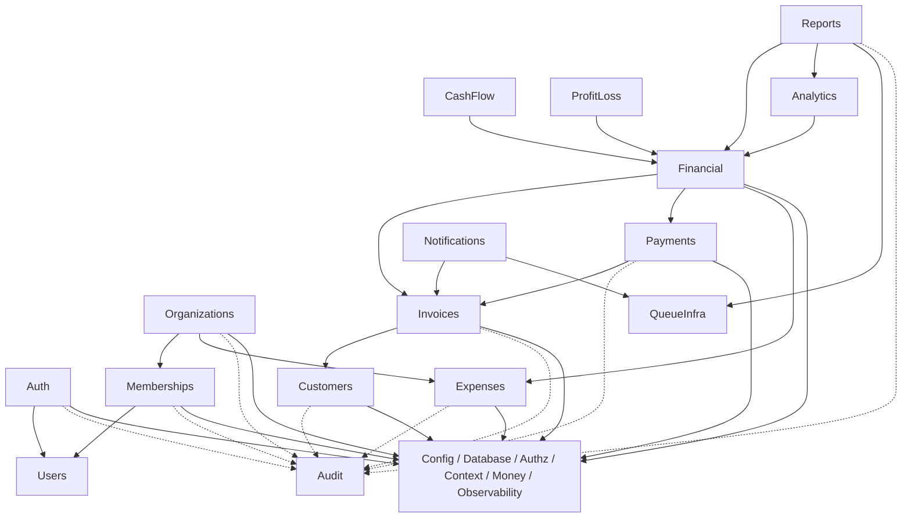

# Repository Blueprint

## 1. Purpose

This document is the implementation blueprint for the NestJS backend repository. It translates the seven preceding planning documents into file ownership, module boundaries, dependency rules, infrastructure placement, testing strategy, and an implementation sequence. It is architectural guidance only: no source code, Prisma schema, migration, test, Docker, or CI artifact is created by this prompt.

When documents differ in level of detail, the existing sources retain their authority:

- `product-requirements.md` owns product scope and the role baseline.
- `backend-architecture.md` owns architectural direction.
- `database-design.md` owns storage and constraint design.
- `domain-rules.md` owns business invariants.
- `api-contracts.md` owns public HTTP semantics.
- `auth-authorization-design.md` owns identity, sessions, permissions, and tenant authorization.
- `implementation-roadmap.md` owns delivery order; this blueprint makes Prompt 5 onward exact.

No domain decision is redesigned here. Names such as `AuthModule` are NestJS code names for the already-defined Authentication domain, and `AuditLogsModule` is the code name for the existing Audit domain.

## 2. Repository philosophy

- Use one repository and one NestJS application codebase. This is not a monorepo.
- Produce an API process and, later, a worker process from the same codebase.
- Organize primarily by business module; shared folders contain only genuinely cross-cutting primitives.
- PostgreSQL is authoritative. Redis, BullMQ, caches, and jobs cannot define financial truth.
- Controllers are HTTP adapters. Application services own use-case orchestration and transaction boundaries. Pure domain code owns calculations and state rules.
- Prefer explicit data and dependency flow over hidden global state or framework magic.
- Use selective persistence abstractions where they enforce tenant safety, transactions, concurrency, or reused complex queries. Do not build a repository abstraction for every table.
- Avoid `BaseRepository`, `BaseService`, `BaseController`, generic CRUD services, a generic tenant repository, a generic event bus, and generic domain base entities. They erase domain semantics without solving a current problem.
- A module exports a small application/read contract, not its controller, Prisma model, or persistence implementation.
- `forwardRef` is exceptional. A dependency cycle is a boundary-design failure until proven otherwise.

## 3. Top-level repository structure

The planned repository is:

```text
/
├── src/                         # NestJS API, domain modules, and shared runtime code
├── prisma/                      # Prisma schema, migrations, and development seed entry point
├── test/                        # Integration/E2E suites and shared test support
├── docs/                        # The eight planning documents; later implementation notes by review
├── scripts/                     # Small operational/dev scripts with documented safety checks
├── docker/                      # Later container support files, not Compose itself
├── .env.example                 # Names and safe examples only; never real secrets
├── .gitignore
├── .editorconfig
├── .prettierrc
├── eslint.config.*
├── package.json                 # Scripts, pinned engines, dependencies
├── package-lock.json            # Reproducible npm dependency graph
├── babel.config.cjs             # Legacy Nest decorator transform for JavaScript builds
├── nest-cli.json
├── jest.config.*                # Unit test configuration
├── jest.integration.config.*    # Real-service integration configuration
├── jest.e2e.config.*            # Nest/Supertest configuration
├── Dockerfile                   # Production image, deferred to production-readiness phase
├── docker-compose.yml           # Local PostgreSQL/Redis development topology
├── AGENTS.md                    # Codex/contributor working rules, created by Prompt 5
└── README.md                    # Setup, commands, architecture links, and safe workflows
```

Conceptual paths do not authorize creation now. Prompt 5 creates only its explicitly listed subset. `docker/` holds later entrypoint or service configuration only when a concrete need exists; an empty directory is not created. `scripts/` must contain narrowly scoped scripts, not a second task-runner ecosystem.

## 4. Full `src/` tree

Folders marked “when needed” are created with their first real file, not as empty scaffolding.

```text
src/
├── main.js
├── app.module.js
├── worker.js                                  # created with real BullMQ workers, not Prompt 5
├── config/
│   ├── app.config.ts
│   ├── auth.config.ts
│   ├── database.config.ts
│   ├── redis.config.ts
│   ├── queue.config.ts
│   ├── logging.config.ts
│   ├── notification.config.ts                # when provider configuration exists
│   ├── env.schema.ts
│   └── config.types.ts
├── common/
│   ├── authorization/
│   │   ├── permissions.ts
│   │   ├── role-permissions.ts
│   │   ├── authorization.service.ts
│   │   ├── require-permissions.decorator.ts
│   │   ├── authorization.guard.ts
│   │   └── authorization.types.ts
│   ├── errors/
│   │   ├── application-error.ts
│   │   ├── error-codes.ts
│   │   ├── error-http-map.ts
│   │   └── prisma-error-translator.ts
│   ├── filters/
│   │   └── global-exception.filter.ts
│   ├── http/
│   │   ├── pagination/
│   │   ├── serialization/
│   │   └── validation/
│   ├── idempotency/
│   │   ├── idempotency.module.ts
│   │   ├── idempotency.service.ts
│   │   ├── idempotency-key.ts
│   │   └── request-fingerprint.ts
│   ├── money/
│   │   ├── decimal.ts
│   │   ├── currency-registry.ts
│   │   ├── money.ts
│   │   ├── money-serializer.ts
│   │   └── rounding.ts
│   ├── request-context/
│   │   ├── request-context.types.ts
│   │   ├── request-context.middleware.ts
│   │   ├── request-context.store.ts
│   │   └── request-id.ts
│   ├── tenant/
│   │   ├── trusted-tenant-context.ts
│   │   ├── tenant-membership.guard.ts
│   │   └── tenant-scope.types.ts
│   └── time/
│       ├── clock.ts
│       └── organization-date.ts
├── database/
│   ├── database.module.ts
│   ├── prisma.service.ts
│   ├── database.types.ts
│   ├── transaction/
│   │   ├── transaction-host.ts
│   │   └── transaction.types.ts
│   └── helpers/
│       ├── tenant-where.ts
│       └── pagination.ts
├── infrastructure/
│   ├── redis/
│   │   ├── redis.module.ts
│   │   ├── redis.connection.ts
│   │   └── redis-health.indicator.ts
│   └── queues/
│       ├── queue.module.ts
│       ├── queue-names.ts
│       ├── job-contracts/
│       ├── producers/
│       ├── processors/
│       └── queue-health.indicator.ts
├── observability/
│   ├── observability.module.ts
│   ├── logger.ts
│   ├── logging.interceptor.ts
│   ├── redaction.ts
│   └── metrics/                              # when metrics are introduced
└── modules/
    ├── auth/
    ├── users/
    ├── organizations/
    ├── memberships/
    ├── customers/
    ├── invoices/
    ├── payments/
    ├── expenses/
    ├── financial/
    ├── cash-flow/
    ├── profit-loss/
    ├── analytics/
    ├── notifications/
    ├── reports/
    ├── audit-logs/
    └── health/
```

`common/authorization` is the chosen RBAC placement rather than a business `AuthorizationModule`: permissions and guards are cross-cutting policy infrastructure with no persistence or independent business lifecycle. It may expose a small globally imported provider module if Nest wiring requires it, but it does not become a domain module. Money primitives similarly live in `common/money`; invoice-specific formulas remain under Invoices, and financial report formulas remain under Financial.

## 5. Module catalog and ownership

Every business module owns its tables and mutations. “Allowed dependencies” means exported contracts or shared infrastructure, never arbitrary access to another module’s tables. All business modules may use Configuration, Database, Authorization, trusted context, Observability, and Audit append contracts where appropriate; these baseline dependencies are not repeated in every row.

| NestJS module | Responsibilities and owned entities | Public contracts | Allowed business dependencies | Forbidden dependencies/actions |
|---|---|---|---|---|
| `AuthModule` | Registration/login/refresh/logout, Argon2id, JWTs, refresh families; `RefreshSession`, `RefreshToken` mutation and auth-side User creation orchestration | authenticate, validate session, revoke sessions | `UsersModule`; Audit append contract | Membership roles, tenant selection, organization claims in JWT |
| `UsersModule` | Global User profile/status and safe user reads; `User` after creation | safe user read, account status read/change | none | Tenant role/permission data |
| `OrganizationsModule` | Organization settings/lifecycle, organization creation orchestration, invoice sequence initialization | create/read/update/close, safe organization context read | `MembershipsModule` owner-creation/transfer contract, Expenses default-category contract | Customer/invoice/payment mutations |
| `MembershipsModule` | Memberships, invitations, lifecycle, ownership transfer mechanics; `Membership`, `OrganizationInvitation` | active membership resolution, lists, invite/status/role/transfer operations | `UsersModule`, shared tenant-status resolution contract | Credentials, JWT issuance, domain finance |
| `CustomersModule` | Customer master data and archive lifecycle; `Customer` | tenant-scoped customer reads and eligibility | none | Invoice ownership/mutation |
| `InvoicesModule` | Invoice aggregate/items/number allocation, snapshots, lifecycle, invoice-specific totals and derived state; `Invoice`, `InvoiceItem`, `InvoiceSequence` mutation | invoice reads; draft/issue/cancel/void; settlement contract used by Payments | `CustomersModule` read/eligibility contract | Payment persistence; report ownership |
| `PaymentsModule` | Recorded payments, full reversals, settlement orchestration; `Payment`, `PaymentReversal` | record/reverse/read payment | `InvoicesModule` settlement contract, Idempotency | Editing invoice terms or owning gateways |
| `ExpensesModule` | Categories and paid-expense lifecycle; `ExpenseCategory`, `Expense` | expense/category operations and read contracts | none | Accounts payable or ledger behavior |
| `FinancialModule` | Canonical cross-source formulas, date-range semantics, reconciliation/read-query contracts; owns no table | exact aggregates and reconciliation queries | invoice/payment/expense read contracts or reviewed read-only query adapters | Mutating source facts or storing aggregate truth |
| `CashFlowModule` | `/cash-flow` use cases and response mapping | cash-flow query | `FinancialModule` | Direct mutation or separate formula definitions |
| `ProfitLossModule` | Simplified cash-basis performance use cases/disclosure | cash-basis performance query | `FinancialModule` | Accrual/GAAP claims or source mutation |
| `AnalyticsModule` | Summary, receivables, aging, collection and delay metrics | analytics queries | `FinancialModule` | Source mutation or independent financial definitions |
| `NotificationsModule` | Durable in-app notification and reminder-delivery state, reminder eligibility, email provider port; `Notification`, `ReminderDelivery` | recipient reads/updates, internal delivery operations | `InvoicesModule` read contract, Queue producer | Treating a job as durable notification state; invoice mutation |
| `ReportsModule` | Previews, export lifecycle/download authorization; `ReportExport` | preview/export/status/download | Financial, Analytics, domain read contracts, Queue producer | Owning or altering financial facts |
| `AuditLogsModule` | Explicit append and tenant-scoped read of `AuditLog` | transaction-aware append, authorized query | none | Business decisions; update/delete in normal flow |
| `HealthModule` | Liveness/readiness endpoints and role-aware dependency indicators | health endpoints | Database, Redis/Queue health indicators | Leaking secrets or detailed topology publicly |

Operational entity ownership:

- `IdempotencyRecord` is owned by the shared Idempotency component because multiple high-risk commands use one protocol.
- `PendingEvent` is owned by queue/event-dispatch infrastructure; a use case creates it through a transaction-aware append contract.
- `InvoiceSequence` remains owned by Invoices even though organization creation initializes it through an exported initialization contract.
- Default `ExpenseCategory` rows remain owned by Expenses; organization creation invokes an explicit tenant-defaults contract in its transaction.

Supporting Nest modules are `ConfigModule` (typed validated configuration), `DatabaseModule` (Prisma lifecycle/transactions), `RedisModule` (Redis lifecycle/health), `QueueModule` (BullMQ connections/contracts), and `HealthModule` (liveness/readiness). Authorization is deliberately shared policy infrastructure rather than a persistence-owning `AuthorizationModule`.

### Ownership dependency rules

- Organizations orchestrates creation and transfer because the organization invariant is the aggregate outcome; Memberships supplies transaction-aware membership operations.
- Memberships does not import Organizations back. Tenant requests receive validated organization status in trusted context; invitation acceptance uses the narrow shared tenant-status resolver. This preserves one-way module dependencies.
- Payments owns “record/reverse payment” and invokes Invoices’ settlement contract. Invoices never calls Payments back.
- Financial may use purpose-built read-only SQL/query adapters spanning source tables when an aggregate cannot reasonably be composed. Those adapters live in `modules/financial/infrastructure`, are tenant-scoped, and may not mutate.
- Reports consumes canonical calculations; it does not reimplement them.
- Notifications and Reports enqueue only through their owned producer ports. Other modules persist `PendingEvent` when reliable post-commit dispatch is required.

## 6. Module dependency graph



Arrows mean “may depend on.” Audit dotted arrows mean the narrow append contract, not unrestricted module coupling. Queue infrastructure does not depend on its producing business modules; processors are registered by the owning module. Any apparent need for two-way access must be resolved by moving orchestration to one use case or extracting a narrow read/command contract. `forwardRef` requires an architecture note and reviewer approval.

## 7. Repeatable module internal structure

A feature module starts with only what it needs:

```text
modules/invoices/
├── invoices.module.ts
├── api/
│   ├── invoices.controller.ts
│   ├── dto/
│   └── invoice-response.mapper.ts
├── application/
│   ├── create-draft-invoice.service.ts
│   ├── issue-invoice.service.ts
│   ├── ports/
│   └── contracts/
├── domain/
│   ├── invoice-calculator.ts
│   ├── invoice-transitions.ts
│   └── invoice.types.ts
└── infrastructure/
    └── invoice.repository.ts
```

- `api/` exists when a module owns HTTP routes. It contains controllers, request/query DTOs, response mappers, and HTTP-only metadata.
- `application/` contains named use cases, workflow orchestration, transaction ownership, sensitive authorization, and exported module contracts.
- `domain/` contains pure calculations, transition validation, policies, and domain types. It imports neither NestJS nor Prisma nor HTTP objects.
- `infrastructure/` contains selective Prisma repositories, SQL query adapters, email/storage adapters, and provider implementations.
- `policies/`, `events/`, `mappers/`, `producers/`, or `processors/` become separate folders only when multiple real files justify them.
- A small CRUD-style module may have a controller, DTO folder, application service, and direct Prisma access in that service’s infrastructure-facing code. It does not need ceremonial ports and mappers.
- A repository is warranted for invoice/payment concurrency, tenant-scoped reusable reads, transaction participation, or provider substitution. It is not warranted merely because a table exists.
- Unit specifications are colocated with the pure file as `*.spec.ts`; infrastructure/API suites live centrally as described below.

## 8. Controllers

Controllers may only:

1. receive route/header/query/body values already processed by global validation;
2. obtain immutable authenticated/trusted context;
3. map the validated DTO to a use-case command;
4. call one application service/use case;
5. map its result to the documented response envelope and headers.

Controllers must never query Prisma, calculate money or totals, implement state transitions, manually interpret role names, open transactions, access Redis, enqueue arbitrary jobs, create audit rows directly, or spread DTO bodies into persistence. Decorator permission metadata is an early coarse check, not final authorization.

## 9. Application services

Application services are named after use cases, not tables. They:

- repeat permission/resource policy for sensitive operations;
- load resources using trusted tenant scope;
- coordinate top-level transactions and deterministic lock order;
- call pure domain calculations and transition rules;
- pass one transaction client to all participating persistence/audit/idempotency/event operations;
- translate known persistence conflicts to stable application errors;
- persist required audit and pending-event facts atomically;
- schedule direct best-effort jobs only after commit, or rely on the durable pending-event dispatcher;
- return application results that response mappers can safely serialize.

They do not wait for email, storage, Redis, or other networks inside a database transaction. Large services are split by use case before they become generic “manager” classes.

## 10. Domain logic and financial calculations

Pure rules should be callable without Nest, HTTP, PostgreSQL, or Redis:

- `common/money`: canonical Decimal parsing, currency scale validation, overflow/scale enforcement, half-away-from-zero rounding, add/subtract/multiply, equality/comparison, and decimal-string serialization.
- `modules/invoices/domain`: line rounding, subtotal/discount/tax/total snapshot calculation, issue readiness, persisted lifecycle transitions, payment-state and overdue derivation.
- `modules/payments/domain`: payment amount/currency/balance validation, reversal eligibility, settlement-cache calculation.
- `modules/financial/domain`: cash-flow, simplified cash-basis performance, collection/cohort and receivables formulas operating on exact Decimal inputs.
- `common/time`: injected clock and organization-local date/range conversion.

The central Money layer must not know invoice lifecycle, payment roles, or report labels. Invoice totals belong to Invoices. Payment settlement belongs to Payments working through the invoice settlement contract. Cross-domain reporting and reconciliation belong to Financial. CashFlow, ProfitLoss, and Analytics are delivery/read-model modules over those canonical calculations.

## 11. Persistence architecture

Use Option C: selective repositories plus direct Prisma in simple module application/infrastructure code.

- Controllers never see `PrismaService`.
- Complex aggregate/concurrency modules (`Auth`, `Memberships`, `Invoices`, `Payments`, Idempotency, Reports export state) use explicit persistence adapters with transaction-aware methods.
- Simple owned-table modules may use `PrismaService` in an application service if queries remain local, tenant-scoped, and easy to test; extract a repository when reuse, locking, raw SQL, or safety warrants it.
- Financial owns explicit read-only query adapters for reviewed cross-table aggregates.
- No `BaseRepository`, repository-per-table mandate, or generic CRUD abstraction.
- A business module never imports another module’s repository or Prisma model access. It uses the other module’s exported application/read contract.
- Tenant-owned method signatures require scope, for example `{ organizationId, invoiceId }`; request/job paths must not offer an ID-only equivalent.

Updates and deletes use tenant-composite predicates and verify affected-row count. Raw SQL is limited to reviewed, parameterized adapters for row locking, PostgreSQL features, or aggregate queries that Prisma cannot express safely.

## 12. Prisma architecture

Planned structure:

```text
prisma/
├── schema.prisma
├── migrations/
└── seed.ts

src/database/
├── database.module.ts
├── prisma.service.ts
├── database.types.ts
├── transaction/
└── helpers/
```

- `DatabaseModule` owns one process-level PrismaClient lifecycle and exports the service/transaction host.
- The API and worker each create one client per process, connect during startup/readiness, and disconnect during graceful shutdown.
- Nest shutdown hooks handle SIGTERM/SIGINT; no module constructs ad hoc Prisma clients in production code.
- `database.types.ts` defines the narrow common type accepted by data operations: root client or Prisma interactive-transaction client.
- Integration/E2E suites create controlled test clients against a verified test URL and disconnect deterministically. Unit tests do not require Prisma.
- Migrations are generated/reviewed under `prisma/migrations`; PostgreSQL-specific partial indexes, checks, `INET`, and composite constraints may use reviewed SQL additions.
- `seed.ts` is development-only and refuses non-development targets. Production migrations never invoke seed automatically.

## 13. Transactions and transaction-client propagation

The top-level application use case owns the interactive Prisma transaction. Conceptually, `TransactionHost.run(callback)` supplies a transaction-scoped database client to the callback. Every participating repository/contract receives that client explicitly as a parameter or through a transaction-scoped unit-of-work object created by the caller.

Rules:

- Never use AsyncLocalStorage to hide the current database transaction.
- A nested service participating in the transaction must accept the supplied transaction context; it must not fall back to global Prisma.
- Low-level helpers never open hidden/nested transactions.
- A top-level use case opens at most one transaction and defines lock order.
- No email, HTTP, object storage, or Redis wait occurs inside it.
- Required audit, idempotency record, source mutation, cached values, and `PendingEvent` commit or roll back together.

Use-case boundaries:

| Use case | Atomic work and concurrency |
|---|---|
| Organization creation | Organization, InvoiceSequence, default ExpenseCategories, ACTIVE OWNER Membership, Audit; rollback all |
| Ownership transfer | Lock Organization then both Memberships in stable ID order; demote old OWNER to ADMIN, promote ACTIVE target, Audit/event; exactly one active OWNER |
| Invoice draft create/update | Currency lock when first financial row, header/items, recalculated snapshot, version, Audit; lock/expected version on update |
| Invoice issue | Lock Invoice then InvoiceSequence, reload/recalculate, snapshot customer/settings, allocate/increment unique number, set ISSUED, Audit/PendingEvent |
| Invoice cancel/void | Lock Invoice first, check payment history/active payments under the established lock order, transition and Audit |
| Payment record | Claim idempotency; lock scoped Invoice; sum RECORDED payments; validate; insert Payment; update paid/balance/version; Audit/PendingEvent; complete idempotency |
| Payment reversal | Claim idempotency; lock Invoice then Payment; insert unique full reversal; mark Payment REVERSED; recompute cache; Audit/PendingEvent; complete claim |

Prisma interactive transactions are used because these workflows require multiple statements and locks. Transaction callbacks must stay bounded and be retried only under a reviewed policy that respects idempotency.

## 14. Authentication infrastructure

Planned `AuthModule` shape:

```text
modules/auth/
├── auth.module.ts
├── api/
│   ├── auth.controller.ts
│   └── dto/
├── application/
│   ├── register.service.ts
│   ├── login.service.ts
│   ├── refresh.service.ts
│   ├── logout.service.ts
│   └── validate-access-session.service.ts
├── domain/
│   └── refresh-session-rules.ts
├── infrastructure/
│   ├── auth.repository.ts
│   ├── argon2-password-hasher.ts
│   ├── jwt-token-service.ts
│   └── opaque-token-service.ts
├── guards/
│   └── access-token.guard.ts
└── strategies/                              # only if Passport strategy is actually chosen
```

Password hashing, token generation/hashing, and JWT signing/verification are narrow injectable provider boundaries. PostgreSQL session/token rows remain authoritative. Access guards verify JWT claims plus current ACTIVE User/RefreshSession. Refresh rotation and reuse detection are application-service transactions. Raw refresh tokens exist only at issuance/request boundaries, never logs or persistence. JWTs contain `sub`, `sid`, `jti`, `iss`, `aud`, `iat`, and `exp`, not tenant roles or permissions.

## 15. Authorization/RBAC

Canonical placement is `src/common/authorization/` because RBAC is code-defined policy shared by every tenant module and owns no data. It contains:

- one `PERMISSIONS` `as const` catalog using exactly the names in `auth-authorization-design.md`;
- the immutable Role-to-permission map for `OWNER`, `ADMIN`, `ACCOUNTANT`, `MEMBER`, `VIEWER`;
- permission types derived from constants, never arbitrary strings;
- a policy service for coarse permission and contextual checks;
- route metadata/decorator and guard;
- actor/authorization context types.

Raw permission strings and scattered role-name checks are forbidden. Owner/Admin target safeguards remain contextual policies in Memberships/Organizations services. Sensitive services repeat authorization so jobs or internal calls cannot bypass controller guards.

The permission constant catalog is fixed to Prompt 3:

| Namespace | Constants/values |
|---|---|
| Organization | `organization.read`, `organization.update`, `organization.close`, `organization.transfer_ownership` |
| Membership | `membership.read`, `membership.invite`, `membership.change_role`, `membership.suspend`, `membership.remove` |
| Customer | `customer.read`, `customer.create`, `customer.update`, `customer.archive` |
| Invoice | `invoice.read`, `invoice.create`, `invoice.update_draft`, `invoice.delete_draft`, `invoice.issue`, `invoice.cancel`, `invoice.void` |
| Payment | `payment.read`, `payment.create`, `payment.reverse` |
| Expense | `expense.read`, `expense.create`, `expense.update`, `expense.void`, `expense_category.manage` |
| Analytics/report | `analytics.read`, `report.read`, `report.export` |
| Notification | `notification.read`, `notification.update_self` |
| Audit | `audit.read` |

## 16. Tenant context

```text
Request
  -> request ID / logging middleware
  -> access-token guard (ACTIVE User + RefreshSession)
  -> tenant membership guard (ACTIVE Organization + Membership)
  -> authorization guard (required permission)
  -> immutable TrustedRequestContext
  -> controller
  -> application service/resource policy
  -> tenant-scoped persistence
```

Trusted tenant context contains:

- `requestId` and internal correlation ID;
- `userId`, `sessionId`, and `accessTokenId` when useful;
- `organizationId`, `membershipId`, and role;
- a derived immutable permission set;
- organization `status`, `baseCurrency`, and `timezone`;
- authentication time/strength metadata needed for recent-auth checks.

Permissions are derived from the current Membership role on each tenant request, not copied from JWT. Including the derived set in the immutable per-request context avoids repeated mapping but does not make it long-lived authority.

Organization IDs from route parameters are untrusted selectors until membership resolution. Body/query tenant IDs on scoped commands are rejected as unknown fields. Cross-tenant or absent owned resources map to the same 404.

## 17. Request context

Use a hybrid approach:

- Explicit immutable context parameters are mandatory for business/application services and repository tenant scope. This is clear in tests and prevents hidden authority.
- AsyncLocalStorage may carry only observability metadata such as effective `requestId`, correlation ID, and logger bindings across framework callbacks. It must not be the sole source of user, organization, permission, or transaction authority.
- Controllers obtain the trusted context built by guards and pass the relevant context explicitly.
- Workers construct a separate trusted worker context only after validating the job and reloading authoritative tenant/resource state.

A valid bounded incoming `X-Request-Id` may be echoed and marked external; otherwise generate a UUID. Generate a separate internal correlation ID if needed because client IDs are not guaranteed unique.

## 18. Tenant-safe query pattern

Every request/job lookup for an organization-owned resource includes trusted tenant scope: `(organizationId, id)`, including child resources. Helper types and selective repositories make the scoped form the default. `findUnique({ where: { id } })` is forbidden for tenant-owned request/job access unless it is inside an already tenant-constrained relation query and the safety is documented in review.

Creates inject `organizationId` from context. Relationships resolve the related ID within the same tenant, and composite database foreign keys remain the final backstop. Read models, exports, notifications, audit reads, and queue workers follow the same rule. Each tenant-owned feature must include Organization A/Organization B negative tests in its Definition of Done.

## 19. DTOs and validation

Request/query DTOs live under the owning module’s `api/dto/`, for example:

```text
modules/invoices/api/dto/
├── create-invoice.dto.ts
├── update-draft-invoice.dto.ts
├── invoice-query.dto.ts
├── issue-invoice.dto.ts
└── invoice-response.dto.ts                 # only if a class is useful for OpenAPI
```

Use request DTO classes for Nest validation and future Swagger metadata. Response classes are not mandatory everywhere: use explicit response types and mappers unless decorators/schema generation require a class. Never return Prisma records directly.

Global validation is configured with allowlisting, `forbidNonWhitelisted: true`, and transformation disabled by default. Targeted primitive conversion may be explicit for safe query fields; money remains a decimal string. DTO validation owns shape, types, enum/UUID/date syntax, bounds, and unknown-field rejection. Domain code owns lifecycle, cross-resource, currency, calculations, balance, and contextual rules. Database constraints remain defense in depth.

Mass-assignment protection is mandatory: DTOs exclude tenant IDs, actor IDs, statuses, totals, balances, timestamps, versions in bodies, audit/job fields, and other server authority. Application services construct write objects field by field.

## 20. Error handling

`common/errors` defines a small application/domain error model with stable code, safe message key/details, and causal metadata for server logs. It preserves the error codes and HTTP mappings in the domain/API documents.

The global exception filter:

- maps validation failures to the documented `VALIDATION_ERROR` field shape;
- maps known application errors to 400/401/403/404/409/422/429 as documented;
- translates reviewed Prisma constraint/transaction failures to stable codes;
- returns `{ error: { code, message, details|fields, requestId } }`;
- hides stack traces, SQL, Prisma metadata, constraint names, and tenant existence;
- logs unexpected errors once with protected stack/context and returns a safe 500.

Do not catch errors merely to log and rethrow at every layer. Catch only to translate, compensate safely, or add meaningful structured context. Never swallow errors.

## 21. Serialization and mapper strategy

Mapping is selective, not a universal three-model layer.

- Every public response is explicitly shaped to remove hashes, tokens, internal IDs/state, and sensitive fields.
- Financial/domain-heavy modules use response mappers for Decimal, dates, derived state, summaries, and envelopes.
- Simple modules may map inline in a dedicated serializer if the shape is obvious and tested.
- Prisma Decimal is never passed through a generic JSON serializer and never converted to JavaScript `number`.
- Money responses use the currency scale and documented decimal strings; quantities/percentages use canonical strings.
- Instants serialize as UTC ISO 8601, business dates as `YYYY-MM-DD`, and BigInt/count values use an explicitly documented safe representation.
- A global interceptor may wrap envelopes only if it does not obscure endpoint-specific metadata; it must not perform blind Decimal conversion.

## 22. Logging and observability

Use Pino from Prompt 5 through a Nest-compatible integration. It provides structured JSON, redaction, request completion logging, and low overhead; human-readable pretty output is development-only.

Standard safe fields include `requestId`, internal correlation ID, service/process, method, route template, status, duration, stable error/event code, and authenticated `userId`/`organizationId` only when useful and policy-safe. Worker logs use job ID/name/attempt and correlation ID. Route templates are logged instead of uncontrolled URLs where possible.

Redact or omit Authorization, cookies, passwords/hashes, access/refresh/invitation tokens, request bodies by default, customer tax identifiers, PAN/CVV, provider secrets, email bodies, and report contents. `observability/` owns logging/metrics plumbing; domain modules own meaningful event names and safe fields.

Metrics are introduced incrementally for request errors/latency, DB latency/pool, transaction conflicts, auth failures, queue depth/age/retries, delivery outcomes, report duration, and reconciliation mismatch. Tracing is optional later and must follow the same redaction rules.

## 23. Request IDs

`common/request-context/request-context.middleware.ts` runs first. It accepts only a conservative bounded UUID/ULID-style inbound `X-Request-Id`; invalid/missing values produce a server UUID. The effective value is returned in `X-Request-Id`, included in errors/logs/audit/PendingEvent, and propagated into job payloads where useful. It is correlation, never identity, authorization, uniqueness, or idempotency evidence.

## 24. Audit architecture

`AuditLogsModule` owns persistence and read API. It exports a narrow `AuditAppender` accepting safe structured facts plus the current root/transaction client. Application services explicitly decide the action, target, actor/context, allowlisted changed fields, and safe before/after metadata. There is no magical Prisma middleware audit because it cannot express business intent reliably and risks secrets or noisy row-level events.

Prompt 22 implements the read API in `src/modules/audit-logs/`. Existing completed
modules retain their explicit transaction-scoped audit writers. The conceptual
`AuditAppender` above is not introduced or used to redesign those writers in this
read-only milestone. AuditLogsService owns a read-only transaction and exports no
persistence mutation contract; controllers only validate and delegate.

These commit atomically with the successful mutation:

- invoice issue/cancel/void and draft mutations;
- payment record and reversal;
- membership role/status changes and ownership transfer;
- organization create/settings/lifecycle;
- expense create/edit/void;
- other required privileged/financial actions listed in existing documents.

Authentication security audits share the relevant auth transaction when a successful state change is required; denied/failure security events may be separately persisted with safe outcome semantics. Operational delivery attempts may be asynchronous. The normal application surface exposes append and authorized read only—no update/delete.

## 25. Idempotency architecture

`common/idempotency/` is a focused component backed by `IdempotencyRecord`. It owns:

- parsing and validating `Idempotency-Key`;
- canonical operation/key/caller scope;
- canonical request fingerprinting using validated values, effective tenant/resource, decimal strings, and business dates;
- transaction-bound claim lookup/create;
- same-hash replay and different-hash conflict;
- safe result reference/status persistence and retention policy.

The top-level use case still owns the transaction and supplies its client. Idempotency never starts a hidden transaction. Payment creation and public reversal require it; other commands use it where existing contracts recommend. It stores no PII-rich response blob.

## 26. Redis

Redis lives at `src/infrastructure/redis/`. The module owns connection creation, configuration, lifecycle, health indication, redacted logging, and test substitution. Initial uses are BullMQ and, later, rate-limit counters or short-lived safe caches only when justified. Do not add general caching by default.

PostgreSQL remains authoritative for sessions, idempotency, notifications, exports, pending events, and all financial state. A Redis failure must not corrupt or roll back a committed financial record. Core API financial writes remain available; asynchronous dispatch is delayed through durable `PendingEvent` records. Redis-backed optimization must fail safely back to authoritative state or return a bounded infrastructure error.

API readiness requires both PostgreSQL and Redis because the current deployment expects background infrastructure to be available. A Redis outage makes readiness fail safely while liveness remains available; it does not make Redis authoritative or permit a queue failure to corrupt committed financial state. Worker readiness also requires both dependencies. Liveness only proves the process/event loop can respond.

## 27. BullMQ and background jobs

Shared queue mechanics live under `infrastructure/queues`; domain ownership remains with the producing/consuming module.

- `queue-names.ts` is the sole queue-name catalog.
- `job-contracts/` holds versioned minimal payload schemas.
- Shared producers implement queue options/correlation, not business eligibility.
- A module registers its processors and owns their application handler: Notifications owns reminder/email jobs; Reports owns export generation; Auth owns session cleanup; queue infrastructure owns pending-event dispatch.
- `worker.ts` is a separate Nest application context created only when real processors arrive.

Planned ownership:

| Queue/job | Owner | Authority |
|---|---|---|
| `reminders.scan`, `reminders.deliver` | Notifications | Scan/reload eligibility and create/update Notification/ReminderDelivery |
| `notifications.email` | Notifications | Reload Notification/Delivery, invoke `EmailProvider`, persist safe outcome |
| `reports.generate` | Reports | Reload ReportExport/filters/current permission policy as applicable, generate bounded CSV |
| `sessions.cleanup` | Auth | Expire/delete credentials per retention only |
| `events.dispatch` | Queue infrastructure | Claim/dispatch durable PendingEvent; no domain mutation authority beyond delivery state |

Workers do not own invoice/payment/expense financial mutations. If a future job needs one, it must invoke the same authorized/idempotent application use case after explicit architecture review.

### Job payload and idempotency rules

Payloads include a schema version, `organizationId` when tenant-owned, target entity/event ID, and correlation/request ID when useful. They contain no trusted role, permission set, total, balance, complete invoice/payment object, secrets, or PII-rich body. Workers validate payloads then reload authoritative state through tenant-scoped contracts.

At-least-once delivery is assumed. Use deterministic job IDs for scheduler singletons or durable event/export IDs, and database semantic uniqueness for reminder delivery `(organizationId, invoiceId, type, effectiveDate, channel)`. Retry transient failures with bounded exponential backoff and jitter. Treat malformed, missing, stale, ineligible, or already-completed work as non-retryable/suppressed according to its contract. Exhausted failures remain observable and alertable. A retry must never duplicate a notification, export state transition, or provider side effect.

### Notification provider boundary

Notifications defines an `EmailProvider` port with a provider-neutral send result and idempotency/provider key. Resend, SendGrid, SES, or another vendor is an adapter, not a domain dependency. Development may use a logging/capture adapter that never logs secrets or full sensitive content. Email remains configuration-gated.

## 28. Configuration

Use Nest Config with Zod runtime validation. Zod provides one fail-fast schema and inferred types without using DTO validation classes for process configuration. No application module reads `process.env` directly after bootstrap.

Config files group and map validated values into typed namespaces: app, database, auth, Redis, queue, logging, and notification. Secrets are read once and exposed only to the owning provider; config logging prints presence or safe metadata, never values.

Conceptual `.env.example` categories:

```text
# App
NODE_ENV, PORT, API_PREFIX, API_VERSION, CORS_ORIGINS

# Database
DATABASE_URL, TEST_DATABASE_URL

# Auth
JWT_ACCESS_PRIVATE_KEY, JWT_ACCESS_PUBLIC_KEY, JWT_ACCESS_KEY_ID
JWT_ISSUER, JWT_AUDIENCE, JWT_ACCESS_EXPIRES_IN
JWT_ACCESS_SECRET                         # only for a reviewed symmetric-signing mode; mutually exclusive with key-pair settings
REFRESH_TOKEN_TTL_DAYS, REFRESH_COOKIE_NAME, REFRESH_COOKIE_SECURE
PASSWORD_ARGON2_MEMORY_COST, PASSWORD_ARGON2_TIME_COST, PASSWORD_ARGON2_PARALLELISM

# Redis / queues
REDIS_HOST, REDIS_PORT, REDIS_USERNAME, REDIS_PASSWORD, REDIS_TLS
QUEUE_PREFIX, WORKER_CONCURRENCY

# Security / logging
LOG_LEVEL, REQUEST_ID_HEADER, TRUST_PROXY

# Notifications (optional/provider-gated)
EMAIL_PROVIDER, EMAIL_FROM, EMAIL_PROVIDER_API_KEY
```

Exact signing-key encoding is decided during implementation and documented in `.env.example`; real keys never appear there. Validate ports/ranges, URL protocol/host expectations, enum values, nonempty production secrets, JWT issuer/audience, CORS list, cookie security, and prohibited production defaults. Boot fails before listening on invalid config.

## 29. Docker development and database workflow

Local development recommendation:

- Run PostgreSQL and Redis through `docker-compose.yml` with named volumes and health checks.
- Run the Nest API/worker directly on the host for fast reload/debugging.
- An optional Compose backend profile may be added only if cross-platform onboarding needs it; it is not the default.
- Production `Dockerfile` is deferred to the production Docker stage.

Prompt 6 creates PostgreSQL development topology; Prompt 7 adds Redis. Conceptual workflow after those prompts:

1. copy `.env.example` to an ignored local environment file and supply local-only values;
2. start PostgreSQL (and Redis when required);
3. install dependencies;
4. validate config and generate Prisma client;
5. apply development migrations;
6. optionally seed development data;
7. run the API; run the worker only for queue features.

Planned package scripts include `start:dev`, `build`, `start`, `lint`, `format`, `format:check`, `test`, `test:unit`, `test:integration`, `test:e2e`, `db:generate`, `db:migrate`, `db:migrate:deploy`, `db:seed`, and safe test-database setup commands.

Development seed data may create a clearly synthetic User, Organization, OWNER Membership, default categories, Customer, and draft/issued sample Invoice. It uses generated/local credentials communicated safely, is repeatable, refuses production, and never seeds real secrets or production data.

## 30. Testing architecture

```text
src/
└── **/*.spec.ts                       # colocated pure/application unit tests

test/
├── integration/
│   ├── database/
│   ├── auth/
│   ├── tenancy/
│   ├── invoices/
│   ├── payments/
│   ├── financial/
│   └── queues/                        # only suites that need Redis
├── e2e/
│   ├── auth.e2e-spec.ts
│   ├── tenancy.e2e-spec.ts
│   └── <feature>.e2e-spec.ts
├── factories/
├── fixtures/
├── helpers/
│   ├── test-app.ts
│   ├── test-database.ts
│   ├── auth.ts
│   └── tenant-scenarios.ts
└── setup/
```

### Unit tests

Colocate `*.spec.ts` beside pure money, invoice calculator, transition, permission policy, payment validation, clock/date, and financial formula files. Unit suites have no PostgreSQL, Redis, network, Nest app, or system clock dependency.

### Integration tests

Use real PostgreSQL for Prisma mappings, Decimal precision, constraints, tenant relationships, transactions/rollback, row locks, invoice numbering, idempotency, refresh rotation, and concurrency. Use separate physical connections for lock/race tests. Start Redis only for queue, retry, duplicate, and outage integration suites; it is not required for ordinary database suites.

### E2E tests

Create a Nest test application using the same bootstrap configuration function as production and Supertest. Apply migrations to the test database before the suite, configure deterministic clocks where needed, create users/tenants through factories or public setup flows, authenticate through real auth endpoints for critical journeys, and assert public status/error/envelope headers. Every tenant-owned E2E family includes A/B isolation, guessed UUID, altered route tenant, and forbidden body tenant tests.

### Test database isolation and safety

Use a dedicated PostgreSQL database identified only by `TEST_DATABASE_URL`; never fall back to `DATABASE_URL`. Test helpers parse and reject URLs unless the database name has an explicit test suffix/prefix and differs from configured development/production targets. Apply production migrations from empty state.

Use deterministic truncation/reset between integration/E2E suites in dependency-safe order, guarded by the verified test target. Transaction rollback is acceptable within an individual test that does not exercise commit/locking, but it is not the global strategy because Prisma/application transactions and multiple connections must be tested. Keep concurrency-heavy files serial where required; factories use generated unique values for parallel safety.

Factories are small composable builders such as `createTestUser`, `createTestOrganization`, `createMembership`, `createCustomer`, `createInvoice`, and `createPayment`. Tenant must be explicit; avoid giant static fixtures and hidden defaults that weaken isolation tests.

### Financial test ownership

- `common/money/*.spec.ts`: parse, precision, scale, overflow, arithmetic, half-away-from-zero, serialization.
- `modules/invoices/domain/*.spec.ts`: per-line rounding, discount, tax, total, lifecycle/overdue.
- `modules/payments/domain/*.spec.ts`: balance and reversal eligibility.
- `test/integration/payments/`: lock-based concurrent payments, caches, idempotency, reversal rollback.
- `modules/financial/domain/*.spec.ts`: cash flow and simplified cash-basis formulas.
- `test/integration/financial/`: source-state inclusion/exclusion, date ranges, cash flow, P&L, receivables and reconciliation.

Tenant A/B isolation is a mandatory Definition of Done for every organization-owned module, not a final hardening task.

## 31. Coding conventions

- Files and folders use kebab-case; Nest artifacts use conventional suffixes (`.module.ts`, `.controller.ts`, `.service.ts`, `.guard.ts`, `.dto.ts`, `.mapper.ts`, `.repository.ts`).
- Classes/types use PascalCase, variables/functions camelCase, constants UPPER_SNAKE_CASE only for true constants.
- DTOs use `CreateInvoiceDto`; application inputs use `CreateInvoiceCommand` or explicit parameters, not DTO types.
- Interfaces describe real boundaries and use descriptive names (`EmailProvider`, `InvoiceSettlementRepository`); do not prefix every interface with `I`.
- Async functions need no `Async` suffix unless both synchronous and asynchronous variants exist; all Promises are awaited or deliberately returned.
- Use absolute path aliases only for stable roots such as `@/common` and `@/modules`; do not create deep alias sprawl. Avoid cross-module deep imports—consume each module’s exported contract.
- Each module exports the minimum providers/types required by consumers. Infrastructure adapters and DTOs stay private unless part of a documented public contract.
- One file should have one primary responsibility; avoid barrel files that create cycles or hide imports.

### JavaScript standards

Enable `strict`, `noImplicitAny`, `strictNullChecks`, `noUncheckedIndexedAccess`, `exactOptionalPropertyTypes`, `noImplicitReturns`, and consistent casing. Avoid `any`; unsafe external/config/job/provider values begin as `unknown` and are validated/narrowed. Do not use non-null assertions to bypass lifecycle/tenant checks. Decimal and money types remain explicit and never loosen to `number`.

### Enum strategy

- Storage lifecycle values that Prisma persists are canonical database/Prisma enums.
- Application code imports/re-exports generated enum values through narrow domain contracts when needed; do not manually maintain a second identical enum.
- Code-only permissions, job names, error codes, and policy sets use `as const` objects plus derived unions.
- Public DTO validation may reference the canonical generated/domain enum, while response schemas document the same values.
- An independent enum is justified only when API concepts intentionally differ from persistence, with an explicit mapper and tests.

### Linting, formatting, and hooks

Use ESLint with JavaScript correctness rules and Prettier for formatting. Enforce unused imports, no accidental globals, import consistency, and no console in production modules. Avoid stylistic rule bloat.

Husky/lint-staged are not MVP requirements. Deterministic package scripts and CI are the source of truth; add hooks later only if the team wants local convenience.

### CI preparation

Later CI runs: locked install, format check, lint, unit tests, provision/migrate PostgreSQL, integration tests, queue tests with Redis, E2E, build, then security/spec/image stages when introduced. Prompt 4 creates no workflow.

## 32. Health, security bootstrap, rate limits, and API docs

`main.ts` will eventually configure, through small bootstrap helpers: validated configuration, Pino, request ID, Helmet, strict CORS, URI prefix `/api/v1`, versioning policy, global ValidationPipe, exception filter, response/logging interceptors, rate limiting, cookie parsing only where auth needs it, and graceful shutdown. Swagger is added only after core routes stabilize.

- `/health/live` checks process responsiveness only.
- API `/health/ready` requires valid config and PostgreSQL; Redis is reported as degraded but does not make the API unready while durable financial writes remain safe.
- Worker readiness requires PostgreSQL and Redis.
- Public health responses are minimal; detailed indicators remain protected logs/metrics.

Rate limiting uses Nest throttling concepts behind a policy/config boundary. Authentication and invitation endpoints receive strong IP/account-key limits; organization/payment/export commands receive elevated limits; ordinary tenant operations use user+organization with IP fallback. Redis-backed distributed limiting may arrive with infrastructure, but PostgreSQL financial correctness never depends on it.

Future Swagger setup should live in a small bootstrap utility such as `src/common/http/openapi/`, document bearer/cookie behavior, decimal strings, errors, cursor metadata, `If-Match`, `Idempotency-Key`, and every status, and be contract-tested against `api-contracts.md`.

## 33. Explicit dependency rules

1. Controllers never import `PrismaService` or transaction APIs.
2. Domain calculation code imports neither NestJS HTTP objects nor Prisma.
3. Financial domain logic never depends on controllers or response DTOs.
4. A business module cannot access another module’s tables/repository arbitrarily; use exported contracts.
5. Redis is never a source of truth.
6. Queue processors validate payloads and reload database state.
7. Route/body `organizationId` is untrusted until membership validation; scoped bodies reject it.
8. `common/` is not a dumping ground; code stays in a domain module until genuinely shared and domain-neutral.
9. Circular module dependencies are redesigned; `forwardRef` requires explicit review.
10. Top-level application services own transactional workflows and transaction-client propagation.
11. Required audit/idempotency/pending-event facts share the domain transaction.
12. No network or queue wait occurs within a database transaction.
13. Tenant-owned queries require trusted tenant scope, including workers and reports.
14. Authoritative money never uses JavaScript `number` or generic JSON conversion.
15. Cross-module exports are narrow application/read contracts, not implementation classes.

## 34. Forbidden patterns

- Business logic, authorization decisions, state transitions, or financial calculations in controllers.
- Prisma, Redis, or BullMQ access from controllers.
- Tenant resource lookup by ID alone on request/job paths.
- Trusting a body/query/route `organizationId` as authorization.
- JavaScript `number` for authoritative money, quantity calculation, or aggregate results.
- Generic client PATCH of invoice/payment/expense lifecycle status.
- Role-name checks scattered through controllers/services or raw permission strings.
- Catch-all `any`, unchecked casts, blind non-null assertions, or unvalidated `unknown` input.
- Repository-per-table, `BaseRepository`, generic CRUD service/controller, or generic tenant repository without concrete value.
- Circular Nest modules or routine `forwardRef`.
- Financial mutation in a background worker without explicit reviewed use-case authority.
- Enqueue-before-commit when delivery depends on a database mutation.
- Hidden/nested transactions or falling back to global Prisma inside an active transaction.
- Swallowing errors, leaking Prisma/SQL details, or logging the same error at every layer.
- Logging passwords, hashes, tokens, cookies, Authorization headers, PAN/CVV, bodies, or report content.
- Giant service classes, giant shared utilities, or giant prompts implementing multiple business modules.
- Prisma records returned directly as API responses.
- General caching introduced without measured need and an invalidation/failure policy.

## 35. Feature Definition of Done and review checklist

A feature is done only when:

- [ ] The relevant planning contract and exact permission are followed.
- [ ] DTO/transport validation and stable errors are implemented; unknown fields fail.
- [ ] Authentication, coarse permission, and sensitive resource policy are enforced.
- [ ] Every tenant query/relationship uses trusted organization scope.
- [ ] Required business rules and database constraints are implemented.
- [ ] Money uses Decimal, server authority, documented scale/rounding, and string serialization.
- [ ] Transaction boundary, lock order, rollback, concurrency, idempotency, audit, and post-commit behavior are correct where applicable.
- [ ] Unit tests cover pure rules and boundary cases.
- [ ] Real-PostgreSQL integration tests cover constraints/transactions where applicable.
- [ ] E2E covers critical public happy/error flows.
- [ ] Tenant A/B and permission-denial tests exist for tenant modules.
- [ ] No known cross-tenant path, mass assignment, or internal error leakage remains.
- [ ] Formatting, lint, relevant tests, and build pass.
- [ ] Docs are updated for any reviewed implementation decision; deviations are reported before expanding scope.

Reusable code review questions:

| Area | Questions |
|---|---|
| Architecture | Is this in the owning module? Is the dependency allowed? Is the controller thin? Is domain logic framework-free? |
| Security | Is the caller authenticated, authorized, tenant-scoped, and protected from mass assignment/IDOR? Are errors/logs safe? |
| Finance | Is Decimal used end to end? Are values server-authoritative? Is the transaction/lock order correct? Are retries/concurrency considered? |
| Tests | Are happy path, validation, authorization, A/B isolation, rollback, idempotency, and concurrency covered in proportion to risk? |

## 36. Prompt 5 exact scope

Prompt 5 objective: **create the NestJS backend repository foundation only**.

It should create:

- root `AGENTS.md` with project purpose, source-of-truth docs, commands, module/file ownership, tenant and money rules, testing expectations, forbidden patterns, and the bounded Codex workflow below;
- NestJS application scaffold at repository root with `src/main.ts` and `src/app.module.ts` only as foundation code;
- JavaScript, npm engine/lockfile, decorator build transform, ESLint, and Prettier configuration;
- the minimum real directories/files needed for configuration validation, Pino logging/redaction, request IDs, base application errors/global exception filter, global ValidationPipe/bootstrap, and Health liveness;
- Jest unit configuration and focused foundation tests;
- `.env.example`, `.gitignore`, `.editorconfig`, and README setup/command documentation;
- package scripts for development, build, lint/format, and unit tests.

Prompt 5 must not create Prisma, `schema.prisma`, migrations, PostgreSQL/Redis Compose services, Redis/BullMQ code, domain entities/modules, authentication, tenant/RBAC business logic, Dockerfile, production Docker, CI, Swagger, or React. `/health/ready` may exist as a skeletal readiness contract but gains database checks in Prompt 6 and role-aware Redis checks in Prompt 7.

Gate A after Prompt 5: a human reviews the tree against this blueprint, strict compiler/lint configuration, config fail-fast behavior, error/request-ID shape, log redaction, bootstrap order, test commands, and confirms no domain/infrastructure scope leaked in.

## 37. Future implementation prompt sequence

The list below preserves the original planning sequence. Explicit user requests
have since delivered Notifications in Prompt 20, Reports in Prompt 21, and the
Audit Log read API in Prompt 22. User Prompt 23 is the next separately requested
hardening milestone and has not started; the older numbers below do not expand
the scope of Prompt 22.

Each item is a separate bounded prompt and stops after its tests/review:

1. **Prompt 5 — Repository foundation + `AGENTS.md`:** exact scope above.
2. **Prompt 6 — PostgreSQL + Prisma foundation:** PostgreSQL Compose service; Prisma packages/config; final reviewed schema from database docs; first migration including reviewed PostgreSQL-specific constraints; Prisma lifecycle/transaction host; guarded test DB; seed framework; readiness; connection, migration, Decimal, composite-constraint tests.
3. **Prompt 7 — Redis + BullMQ foundation:** Redis Compose service/config/lifecycle; BullMQ root connection, queue names and versioned base contract; API/worker health semantics; graceful shutdown and outage tests. No reminders/reports or business processor.
4. **Prompt 8a — Auth persistence/security:** User/RefreshSession/RefreshToken data, Argon2id, opaque token hashing, JWT providers, transaction/repository tests.
5. **Prompt 8b — Auth HTTP flows:** registration/login/access guard, then refresh rotation/reuse/logout/logout-all in a separate slice if needed; rate-limit/CSRF/CORS and E2E hardening.
6. **Prompt 9 — Organizations:** organization creation/settings/lifecycle, sequence/default-category initialization, Owner atomic creation, audit append foundation.
7. **Prompt 10 — Memberships:** invitation and membership lifecycle, role changes, ownership transfer, concurrency tests.
8. **Prompt 11 — RBAC:** canonical constants/map, guards/decorator/policy, exhaustive role matrix.
9. **Prompt 12 — Tenant context/isolation:** tenant guard/context, scoped persistence conventions, adversarial A/B harness.
10. **Prompt 13 — Customers:** first complete tenant vertical slice.
11. **Prompt 14a–c — Invoices:** Money primitives and draft calculation; issue/number/freeze; cancel/void/derived states.
12. **Prompt 15a–b — Payments:** idempotency and record/locking; reversal/reconciliation.
13. **Prompt 16 — Expenses:** categories and expense lifecycle.
14. **Prompt 17 — Financial engine:** canonical aggregate/reconciliation/date contracts.
15. **Prompts 18, 19, 20 — Cash flow, simplified P&L, Analytics:** one read family per prompt.
16. **Prompt 21 — Durable events and real workers:** PendingEvent dispatcher, processor bootstrap, retry/dead-letter conventions.
17. **Prompt 22 — Notifications/reminders:** durable state, scheduler, provider boundary, idempotent delivery.
18. **Prompt 23 — Reports:** previews, CSV safety, export worker/state/download authorization.
19. **Prompt 24 — Audit query/retention hardening:** full action coverage and append-only verification.
20. **Prompts 25–29 — Security, system tests, OpenAPI, production Docker, CI/CD:** one concern per reviewed prompt.

Organizations, Memberships, RBAC, and tenant isolation must pass before Customers or any tenant financial module. Queue foundation in Prompt 7 establishes connectivity only; domain jobs wait until their source facts and durable event rules exist.

### Codex working rules

For every future prompt, Codex must:

1. read `AGENTS.md` and relevant planning documents before changing files;
2. implement one bounded feature only;
3. run formatter, lint, focused tests, and broader tests appropriate to risk;
4. inspect failures and fix only related failures;
5. summarize changed files and behavior;
6. list exact checks/tests run and outcomes;
7. report any architectural deviation or unresolved decision;
8. stop before starting the next feature/module.

### Review gates

| Gate | After | Human inspection |
|---|---|---|
| A | Repository setup | Tree, strict config, bootstrap order, errors/request IDs/log redaction, deterministic commands, no premature domain code |
| B | Prisma/schema/migrations | Entity/enum names, tenant keys/composite FKs, Decimal native types, partial/check constraints, migration SQL, seed/test DB guards, transaction host |
| C | Authentication | Argon2 parameters, JWT claims/keys, cookie/CORS/CSRF, refresh atomicity/reuse, revocation immediacy, secret redaction, auth E2E |
| D | Organizations + Memberships + RBAC + tenant isolation | Exactly-one-Owner behavior, transfer locks, permission matrix, trusted context, 403/404 behavior, A/B suite, no unscoped access |
| E | Invoices + Payments | Exact rounding, immutable issue snapshot, numbering locks, payment lock/order, caches/reconciliation, idempotency, reversal, atomic audit, concurrency tests |
| F | Financial reporting | Cash-basis definitions/labels, source-state exclusions, timezone/date/cohort metadata, Decimal serialization, reconciliation and query plans |

## 38. Consistency record

The final cross-document review preserved these canonical terms and rules:

- Roles: `OWNER`, `ADMIN`, `ACCOUNTANT`, `MEMBER`, `VIEWER`; permission strings are exactly those in `auth-authorization-design.md`.
- Global identity uses User; tenant authority uses ACTIVE Membership; JWT contains no tenant authority.
- Session family is `RefreshSession`; immutable rotations are `RefreshToken` rows.
- Trusted tenant resolution is access authentication → ACTIVE Organization/Membership → permission → resource policy → tenant-scoped persistence.
- Invoice persisted states are `DRAFT`, `ISSUED`, `CANCELLED`, `VOID`; `UNPAID`, `PARTIALLY_PAID`, `PAID`, and overdue are derived.
- Payments are one-invoice, positive, immutable, full-reversal corrections; creation and public reversal require idempotency.
- Decimal storage/API, per-line rounding, transaction boundaries, lock order, audit atomicity, job ownership, and PostgreSQL authority are unchanged.
- The only narrow planning correction is implementation sequencing: this Prompt 4 supplies the repository blueprint; Prompt 5 creates `AGENTS.md` with the repository foundation; Prompt 6 owns PostgreSQL/Prisma; Prompt 7 owns Redis/BullMQ connectivity. The roadmap is updated accordingly.

# Prompt 4 Review Checklist

- [x] Top-level repository layout finalized
- [x] src layout finalized
- [x] All NestJS modules identified
- [x] Module ownership defined
- [x] Module dependency graph documented
- [x] Circular dependency strategy defined
- [x] Controller responsibilities defined
- [x] Application-service responsibilities defined
- [x] Domain-logic placement defined
- [x] Prisma access strategy finalized
- [x] Transaction ownership defined
- [x] Transaction-client propagation strategy defined
- [x] Money utility location finalized
- [x] Authentication code placement finalized
- [x] RBAC code placement finalized
- [x] Tenant-context strategy finalized
- [x] Request-context strategy finalized
- [x] Error architecture finalized
- [x] Decimal serialization architecture finalized
- [x] Logging/request-ID strategy finalized
- [x] Audit integration strategy finalized
- [x] Redis boundary finalized
- [x] BullMQ structure finalized
- [x] Job payload/idempotency rules finalized
- [x] Configuration structure finalized
- [x] Environment variables documented
- [x] Docker development topology defined
- [x] Test folder structure finalized
- [x] Test DB isolation strategy finalized
- [x] JavaScript standards finalized
- [x] Dependency rules documented
- [x] Forbidden patterns documented
- [x] Feature Definition of Done documented
- [x] Prompt 5 exact scope defined
- [x] Future implementation sequence defined
- [x] AGENTS.md scope defined
- [x] No application code generated
- [x] No Prisma schema generated
- [x] No Docker files generated
